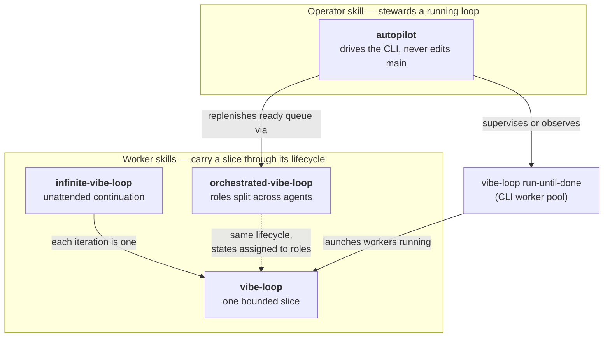

# vibe-loop

`vibe-loop` is a small execution engine for one-slice AI coding loops. It
selects one unblocked task from a repository task source, locks it, runs an
agent command such as `codex exec '$vibe-loop <task_id>'`, captures logs,
validates completion, records local run metadata, and can repeat until no
runnable tasks remain.

The CLI is a supervisor, not a branch or worktree manager. It owns task
discovery, selection, locks, process execution, logs, completion checks, and
run records. The configured worker agent owns branch/worktree setup,
implementation, review, and any merge-to-`main` workflow defined by the
repository instructions.

The runtime is built around four bundled skills — see [Skills](#skills) — which
also work on their own in Codex or Claude without the CLI.

> [!WARNING]
> `vibe-loop` is in early development. It is not yet well tested or broadly
> reviewed, so treat it as experimental automation and run it only where failed
> commands or incorrect agent behavior cannot damage important work.

## Installation

`vibe-loop` requires Python 3.11 or newer.

Install it as a standalone CLI:

```bash
uv tool install vibe-loop
pipx install vibe-loop
```

Install it into an existing Python environment:

```bash
python -m pip install vibe-loop
```

For unreleased changes, install the current repository state from GitHub:

```bash
uv tool install git+https://github.com/ei-grad/vibe-loop
```

## Quick Start

Point `vibe-loop` at a supported task source. For a small repository, this
Markdown table is enough:

```markdown
| ID | Priority | Status | Dependencies | Scope | Acceptance | Evidence |
| --- | --- | --- | --- | --- | --- | --- |
| TASK-01 | P0 | Next | none | Make one scoped change. | Tests pass. | Not run. |
```

For an existing planning format, generate a repo-specific profile instead:

```bash
vibe-loop tasks configure --repo . --dry-run --json   # review candidate
vibe-loop tasks configure --repo . --json             # activate
```

Inspect runnable work, then run one selected task with the configured agent:

```bash
vibe-loop tasks list --repo .
vibe-loop tasks tree --repo .
vibe-loop next --repo .
vibe-loop run-next --repo .
```

Add `--ask-agent` to delegate selection to the configured selection command
after the mechanically safe candidate list is built:

```bash
vibe-loop run-next --repo . --ask-agent
vibe-loop run-until-done --repo . --ask-agent
```

> [!NOTE]
> Worker commands and direct skill use work best when routine edits, tests,
> reviews, and integration steps do not stop on permission prompts. Configure
> Codex or Claude with a thoroughly scoped allowlist and `dontAsk` mode.

> [!WARNING]
> With permission prompts disabled, any Codex or Claude session — launched
> directly or by a worker command — MUST run in isolation (Docker container or
> VM) with only the required repository, tools, network access, and credentials
> available.

## Skills

The package includes four installable skills — three worker skills and one
operator skill:

- **`vibe-loop`** — one coherent bounded slice. The agent inspects the task,
  edits, verifies, asks for independent review when available, commits,
  integrates to `main` when policy permits, cleans up, and stops.
- **`infinite-vibe-loop`** — unattended continuation across finite slices. After
  each slice it chooses conservative next work, reports blocked paths, and
  continues until stopped.
- **`orchestrated-vibe-loop`** — multi-agent execution where the main agent keeps
  orchestration state and delegates exploration, implementation, and independent
  review without doing the code or review work itself.
- **`autopilot`** — unattended stewardship of the loop. The agent drives
  `vibe-loop run-until-done`, reviews what landed each cycle, troubleshoots
  worker sessions, replenishes the ready queue by invoking `orchestrated-vibe-loop`
  to plan and decompose work, recovers the supervisor from evidence, and sleeps
  between cycles with `vibe-loop wait-helper`. Unlike the worker skills it drives
  the CLI by design, and it never edits the main worktree itself.

The worker skills share one slice lifecycle; the operator skill drives a worker
pool and delegates to them. They compose rather than transition into each other:



See [docs/skill-work-modes.md](docs/skill-work-modes.md) for the orchestrated
swimlane, the autopilot operator cycle, and a mode-selection guide.

Install them into Codex and/or Claude:

```bash
vibe-loop install-skills --codex --claude
```

The worker skills do not require the CLI; you can invoke them directly for manual
bounded or unattended work. The `autopilot` operator skill does drive the CLI.
The CLI exists when a repository already has a task source and you want
repeatable orchestration: candidate discovery, locks, configured worker
commands, run logs, completion checks, and run metadata.

All three worker skills treat post-integration cleanup as separate from running
the loop, integrating a task, or reporting completion. Effective user and
repository instructions control deletion: an explicit no-delete or
confirmation-required instruction means the worker retains the merged worktree
and local branch, reports the exact worktree path and local branch name, and
still records completion with commit provenance. Only express cleanup
authorization permits removal, and the worker must still verify that the
worktree is clean and merged, ownership is clear, no active agent uses it, and
repository policy permits cleanup.

## Commands

### Tasks

```bash
vibe-loop tasks list --repo .
vibe-loop tasks tree --repo .
vibe-loop tasks inspect QUERY-09 --repo .
vibe-loop tasks runnable --repo .
vibe-loop tasks locks --repo .
vibe-loop tasks configure --repo . --dry-run --json
vibe-loop tasks configure --repo . --force-refresh --json
vibe-loop tasks configure --repo . --promotion-toml
vibe-loop next --repo .
```

`vibe-loop tasks` without a subcommand is a compatibility alias for
`vibe-loop tasks runnable`.

### Run

```bash
vibe-loop run-next --repo . --ask-agent
vibe-loop run-until-done --repo . --ask-agent --jobs 2
```

`--ask-agent` hands the agent the mechanically safe candidate list plus recent
`.vibe-loop/runs.jsonl` entries and log tails. The CLI validates returned IDs
against current unlocked candidates, rejects duplicates and unknown or locked
tasks, and falls back to deterministic ready order before spawning. When task
sources declare `resources` or `paths`, the scheduler also rejects overlapping
conflict domains; undeclared tasks are not paired once conflict-domain
scheduling is active.

`run-next` always runs a single worker. `run-until-done` is serial by default;
`--jobs N` keeps up to `N` workers active, each with its own task lock, run id,
and log path. Two independent stop limits bound a `run-until-done` session:

| Flag | Caps | Counts | Default |
| --- | --- | --- | --- |
| `--max-slices N` | total dispatched slices | every attempt, any outcome | `0` (unlimited) |
| `--max-tasks N` | completed slices | only `completed` results | `0` (unlimited) |

Whichever limit is reached first ends the loop. Under `--jobs`, the scheduler
never dispatches more in-flight work than the remaining `--max-tasks` budget
allows, so completed runs do not overshoot `N`.

`run-next` and `run-until-done` keep their result JSON on stdout; progress and
mirrored agent stdout go to stderr, and full streams are captured in
`.vibe-loop/runs/<run-id>.log`. Each result includes a `run_id`.

#### Agent session transcripts

For Claude workers the supervisor injects a known `--session-id <uuid>` into the
worker command, so the run records the agent's real session id
(`session_id_source` = `observed`) and a `transcript_path` pointing at the
agent's own transcript (`$CLAUDE_HOME/projects/<encoded-cwd>/<uuid>.jsonl`,
default `~/.claude`). The result record's path is resolved by globbing for the
unique session id after the run, so it is correct regardless of how Claude
encodes the working directory; the earlier `run_started` record carries a
predicted path before the transcript exists. An operator can go straight from a
`runs.jsonl` record (or `vibe-loop runs`) to the transcript file to see what the
agent actually did. The path is best-effort: if the agent persists no transcript
(for example `--no-session-persistence`), the recorded path may not exist.
Injection is skipped when the command already pins `--session-id`.

Codex `exec` has no equivalent flag to force or print a session id without
switching stdout to `--json` (which would replace the streamed human-readable
output the wrapper log and the selection/analysis text parsing rely on), so
Codex worker runs keep `session_id_source = fallback:run_id` and no
`transcript_path`. If a worker instead emits a `session id: ...` line on its
output, that native id is captured with `session_id_source` =
`native:stdout`/`native:stderr`.

#### Unknown-run recovery

A worker that does real work, commits to its claimed branch, then exits without
filing a clear terminal report — for example a one-shot `claude -p` that parks
on a billable external/authorization gate and quits — leaves the run `unknown`:
never merged, never reported. Rather than stop or re-attempt the task from
scratch (which orphans the committed-but-unmerged work), `run-until-done`
deterministically launches a bounded continuation worker for `unknown` runs.

Recovery uses the normal read-write worker command path (not the read-only
analysis agent of `--ask-agent`). The continuation worker receives a recovery
prompt carrying the task id, the prior `run_id`, the claimed branch and worktree
(from the `workspace_claim` record), the prior agent transcript path and wrapper
log, and the instruction to investigate, finish the work and/or emit a proper
status, and report `blocked` with a precise reason instead of parking again. It
builds on the existing claimed branch/worktree and never deletes, resets,
steals, or merges another worker's committed work.

Recovery is bounded by the same per-task budget as transient restarts
(`supervision.max_restarts`): each attempt is counted through the `task_restart`
record, and once the budget is exhausted the run is left with a terminal
`failed` record (`classification_source = recovery_budget_exhausted`) so an
`unknown → recover → unknown` cycle cannot loop. Every recovery launch and its
outcome are journaled append-only as `task_recovery` records in
`.vibe-loop/runs.jsonl`. Set `supervision.recover_unknown_runs = false` to
disable recovery and have the supervisor stop on `unknown` as before.

### Worker-side commands

Workers can report status, claim a workspace, and serialize final integration
while the supervisor run is active.

```bash
# Report final status (authoritative for classifying that run).
vibe-loop report --repo "$VIBE_LOOP_REPO" --run-id "$VIBE_LOOP_RUN_ID" \
  --task-id "$VIBE_LOOP_TASK_ID" --status blocked --commit HEAD \
  --message "waiting on reviewer" --metadata-json '{"reason":"review"}'

# Make branch/worktree ownership visible (advisory metadata only).
vibe-loop worker claim-workspace --repo "$VIBE_LOOP_REPO" \
  --run-id "$VIBE_LOOP_RUN_ID" --task-id "$VIBE_LOOP_TASK_ID" \
  --branch "$BRANCH" --worktree "$WORKTREE"

# Serialize the refresh/verify/fast-forward-merge critical section.
vibe-loop main-integration acquire --repo "$VIBE_LOOP_REPO" \
  --run-id "$VIBE_LOOP_RUN_ID" --task-id "$VIBE_LOOP_TASK_ID" --wait --timeout 300
vibe-loop main-integration release --repo "$VIBE_LOOP_REPO" \
  --run-id "$VIBE_LOOP_RUN_ID" --task-id "$VIBE_LOOP_TASK_ID"
vibe-loop main-integration status --repo .
```

Report statuses are `completed`, `blocked`, `failed`, and `unknown`. Reports
classify a run but are not task-source mutations and do not mark a task `Done`;
before reporting `completed`, the worker should update the active task source.
Without a report, the supervisor falls back to exit status, completion checks,
task probing, and main-branch change heuristics.

`claim-workspace` requires a matching active task lock and verifies the worktree
is on the requested branch; it records branch, worktree, base commit, HEAD, and
dirty state, and never creates, deletes, resets, merges, or cleans up
branches/worktrees. `main-integration acquire --wait --timeout N` waits for a
live or unknown holder; stale locks are reported, never stolen. If the active
task lock has a workspace claim, acquisition is blocked when the claim's
diagnostics make integration unsafe. Worktree and branch handling stay outside
the CLI runtime — put that policy in repository instructions or the agent
command.

### Status and diagnostics

```bash
vibe-loop workers --repo . --json
vibe-loop runs list --repo .
vibe-loop runs inspect <run-id> --repo .
vibe-loop doctor --repo . --json
vibe-loop specs check --repo . --json
vibe-loop --version
```

`runs list` groups records by run id and shows the latest status plus log path;
`runs inspect <run-id>` prints the detailed record history. `vibe-loop
--version` prints the package version; editable source-tree and non-tag Git
installs append `(git <short-sha>)`.

### Evals

```bash
vibe-loop eval local-demo --repo . --trials 3 --agent-command '*=codex exec {prompt}'
vibe-loop eval release-gate --repo . --overwrite --record-output .vibe-loop/release-readiness.json
vibe-loop eval benchmark --adapter manifest --manifest path/to/benchmark.json
```

`eval local-demo` materializes fresh bundled fixture repositories, runs the same
prompt across selected skill conditions and agent commands, and emits
`aggregate.json`/`aggregate.md` with a `skill_quality` section that separates
task failures from workflow-contract failures and compares against any previous
aggregate.

`eval release-gate` is the bundled skill release-readiness check. Without
`--aggregate`/`--dry-run` it runs a 21-trial release matrix and writes a
`skill_release_readiness` record. It requires required trials to pass and blocks
unresolved `workflow_contract_regression` findings; a regression is accepted only
when parked with a task id (e.g.
`--parked-regression condition_comparison:vibe_loop=EVAL-99`). `eval benchmark`
runs an explicit external smoke manifest through the same paired-condition
harness without claiming public leaderboard comparability. See
[`docs/skill-evaluation-strategy.md`](docs/skill-evaluation-strategy.md) and
[`docs/external-benchmark-fit.md`](docs/external-benchmark-fit.md).

The optional post-`0.2.0` SWE-rebench V2 follow-up uses
`eval/benchmarks/swe-rebench-v2-smoke.json`. Its 24 pinned multilingual
instances require an operator-supplied matching task export, pinned upstream
harness checkout, pre-pulled Docker images, and an agent wrapper that writes
one matching, non-empty patch in `patches.json`. The adapter executes an archive
of the pinned harness revision and verifies complete task-record fingerprints, then
uses the upstream report to distinguish `agent_failed` from
`infrastructure_failed`; neither category changes the local release gate.
These status fields are part of benchmark result schema version 2.
External results enter a release-readiness record only when its path is passed
explicitly with `eval release-gate --external-benchmark-json ...`.

The release matrix includes default table discovery, generated heading profiles,
explicit list profiles, Spec Kit, Kiro, OpenSpec, and command-backed task/lock
stories. Aggregate and release-readiness records retain compact trial links but
exclude raw task-source, lock, completion, planning, and worklog command strings.

## Autopilot

Autopilot supervises one repository (or a registry of several) and drives
`run-until-done` cycles. Its default worktree policy is report-only: starting
autopilot does not authorize deleting worktrees or branches. It never resets
branches, steals locks, or mutates tracked project files on its own. See
[`docs/prd/autopilot.md`](docs/prd/autopilot.md) for the full contract.

```bash
vibe-loop autopilot status --repo . --json
vibe-loop autopilot run --repo . --once
vibe-loop autopilot run --repo . --once --worktree-disposition reap
vibe-loop autopilot run --repo . --interval 60 --max-cycles 10 --jobs 2
vibe-loop autopilot projects register --repo . --name my-project
vibe-loop autopilot projects register --repo . --name tasks \
  --context LOOPYARD_PROJECT=vibe-loop
vibe-loop autopilot projects status --json
vibe-loop wait-helper --pid 12345 --json
```

**`status`** collects a read-only snapshot — queue counts, runnable tasks, active
workers, stale locks, workspace diagnostics, git refs/dirty state, the
main-integration lock, supervisor state, blockers, and the last cycle. It never
starts a worker or mutates state. The `--json` `ProjectStatus` payload is the
machine-readable boundary consumed by external status surfaces such as the
loopyard web UI (board, agents, and timeline screens). Supervisor state
correlates the live supervisor lock with append-only started or observed
records, preserving its run ID, PID, and log even when newer cycle records are
idle and PID-less; `last_cycle` independently reports the newest cycle.

**`run`** is a foreground supervisor that launches `run-until-done` as a child
and append-records one `autopilot_cycle` per iteration. Before each launch
decision it cleans only stale worker locks whose recorded worker process is
missing — the same validated, audited path as `vibe-loop workers clean --force`
(it emits `lock_expired` records and never deletes worktrees, resets branches,
steals live locks, or removes a lock that has not yet observed a worker PID).
Each cycle then runs a native worktree-disposition step and gathers per-worktree
evidence mechanically. The default `report-only` policy journals eligible
candidates without invoking the analysis agent, removing a worktree, or deleting
a branch. Only an explicit `[autopilot] worktree_disposition = "reap"` setting or
`--worktree-disposition reap` CLI override opts in to automatic disposition.
Under that policy, the read-only analysis agent must return a reasoned reap
decision and the executor still limits removal (`git worktree remove` plus
`git branch -d`) to merged, clean, non-live-claimed leftovers — never the
primary worktree and never dirty or unmerged work-in-progress. Every cycle
journals the configured policy, candidate evidence, reasons, outcomes, and
`worktree_disposition_policy:*`, `worktree_disposition_candidates:N`, and
`reaped_worktrees:N` action tags.
A cycle is still blocked (never force-recovered) when preflight diagnostics are
unsafe: dirty repo, remaining stale locks, unsafe workspace diagnostics, missing
task source, or an unavailable agent command. `--once` runs one cycle. Without `--interval`, it drains runnable
work and exits when a cycle is idle or blocked; with `--interval N` it stays
resident, sleeping `N` seconds between cycles until `--max-cycles` or an
interrupt. `--jobs`, `--ask-agent`, `--continue-on-failure`, `--max-slices`, and
`--max-tasks` are forwarded to each child; `--min-ready` sets the minimum
runnable depth required before launching. If the queue is below that depth and
no explicit `[autopilot] planning_command` is configured, the cycle records
`planning_unconfigured` with the low/no-runnable observation instead of
authoring new tasks itself. A single supervisor lock prevents duplicates; Ctrl-C
terminates the in-flight child and releases the lock.

**`projects`** manages an optional multi-project registry (`register`, `list`,
`remove`, `status`). It records repo paths and display names in a small JSON file
(default `~/.vibe-loop/projects.json`, `--registry` to override); each project
keeps its own state directory. A repeated `register --context NAME=VALUE` option
adds bounded, non-secret selectors for repositories whose command-backed task
source or lock adapter needs distinct context such as `LOOPYARD_PROJECT`.
Selectors are copied literally into only those subprocess environments, never
shell-interpolated or added to global `os.environ`. Names must be selector-
shaped, with suffixes such as `_PROJECT`, `_BOARD`, `_TENANT`, `_WORKSPACE`,
`_NAMESPACE`, `_REPO`, `_TEAM`, or `_SELECTOR`. Secret-like names/values,
loader and shell-startup controls, command lookup paths, credential/config
selectors, and `VIBE_LOOP_*` protocol variables are rejected. Context values
remain only in the registry; `projects list`, `inspect`, and `status` recursively
redact them even if an adapter echoes one in a valid payload or diagnostic.
Existing registry entries without `context` remain valid.
`projects status [--json]` returns one aggregate entry per repo, and a repo that
cannot be read becomes an isolated error entry so one broken project never hides
the others.

Interactive status dashboards (board, agents, and timeline/Gantt screens) live
in the [loopyard](https://github.com/ei-grad/loopyard) web UI, which consumes the
read-only `autopilot status --json` / `projects status --json` boundary. The
former in-tree `autopilot tui` (Textual) and `autopilot webui` surfaces were
removed in favor of loopyard.

The top-level **`vibe-loop wait-helper`** blocks until a watched process exits,
a wall-clock deadline arrives, or an optional message adapter returns a direct
user instruction, so an unattended steward can sleep between cycles.
`--pid` (repeatable) wakes on process exit; `--cycle-schedule [SECONDS]` wakes at
the next UTC `*/SECONDS` boundary; omitting both `--deadline` and
`--cycle-schedule` uses the default 1800s boundary. `--deadline` takes an
explicit ISO-8601 UTC time; `--mode all` waits for every PID. It prints
`wake_reason` (`pid`, `all_complete`, `deadline`, or `message`) with a summary.

`--message-command COMMAND` polls a trusted command that emits
`{"received":false,"message":null}` or a received message containing `id` and
`content`. The recipient comes from `--session-ref` or `VIBE_LOOP_RUN_ID` and is
passed literally as `VIBE_LOOP_WAIT_SESSION_REF`; `--message-timeout` bounds
each poll. For Loopyard-backed projects, the matching adapter is:

```bash
vibe-loop wait-helper --pid 12345 --message-command \
  'loopyard vibe session-message-receive' --session-ref <run-id> --json
```

Loopyard messages are consumed atomically and delivered at most once after the
receive transaction commits. Adapter failures return `wake_reason=adapter_error`
without including command output in the result.

## Configuration

All configuration is optional. A typical `.vibe-loop.toml`:

```toml
main_branch = "main"
state_dir = ".vibe-loop"

[agent]
# Optional when kind = "auto" and Codex or Claude is available on PATH.
kind = "auto"
# model = "gpt-5.4"  # optional; inferred commands add the kind-specific flag
command = "codex exec {prompt}"
selection_command = "codex exec {prompt}"
# analysis_command runs a read-only agent for autopilot decisions; the default is
# read-only by construction (Codex read-only sandbox; Claude with Edit/Write/
# NotebookEdit disallowed). Override only with another read-only invocation.
# analysis_command = "codex exec --sandbox read-only {prompt}"
forward_stderr = false   # agent stderr is log-only by default; set true to mirror it

[task_source]
type = "markdown-plan"
# Set source keys only when you want to pin Markdown discovery.
plan_path = "PLAN.md"
plan_paths = ["PLAN.md", "docs/PLAN.md", "ROADMAP.md", "TODO.md"]
runnable_statuses = ["Active", "Next", "Planned"]

[completion]
commands = [
  "uv run python scripts/record_worklog.py --validate",
  "uv run python scripts/generate_gantt.py --coverage-check",
]

[supervision]
max_restarts = 3
cooldown_seconds = 30.0
recover_unknown_runs = true   # set false to stop on `unknown` instead of launching a continuation worker
worker_timeout_seconds = 10800.0  # wall-clock cap per worker; its process group is killed and the task returns to runnable. 0 = unbounded

[locks]
type = "directory"
# lease_seconds = 300   # locks go stale after this many seconds without a heartbeat

[autopilot]
# Defaults for `autopilot run`; explicit CLI flags override these.
# jobs = 2
# interval_seconds = 60.0
# min_ready = 1
require_clean_repo = true   # set false to let a dirty tree run a cycle
# Safe default: inspect and journal eligible worktrees without removing them.
# Set to "reap" only as an explicit operator opt-in; existing safety guards remain.
worktree_disposition = "report-only"
# Optional user-authored maintenance hooks, redacted in status/doctor JSON.
# A failing health command blocks the launch; planning runs when the runnable
# queue is below min_ready; if planning is not configured, the cycle records
# planning_unconfigured. Summary runs after a launch; troubleshoot runs after a
# failed child. Generated profiles can never introduce these hooks.
# health_command = "scripts/health.sh"
# summary_command = "scripts/summary.sh"
# troubleshoot_command = "scripts/troubleshoot.sh"
# planning_command = "scripts/plan.sh"
```

When `--repo` points at a Git linked worktree without its own `.vibe-loop.toml`,
`vibe-loop` falls back to the main worktree's config (warning on stderr).
Runtime state, locks, logs, and caches still live under the invoked `--repo`
worktree.

### Agent command and prompt dialect

The executable command and the worker prompt dialect resolve independently.
`agent.command` and `agent.selection_command` are shell templates; `agent.kind`,
`agent.prompt_dialect`, and `agent.skill_ref_prefix` control how the prompt
references the bundled skill. Explicit `.vibe-loop.toml` command values stay
authoritative — no generated profile can introduce executable commands.

| `kind` | Behavior |
| --- | --- |
| `auto` (default) | Omitted commands use deterministic supported-agent detection. |
| `codex` | Codex-style worker prompts with `$vibe-loop`. |
| `claude` | Claude-style worker prompts with `/vibe-loop`. |
| `custom` | Explicit templates; requires `prompt_dialect` or `skill_ref_prefix`. |

Under `kind = "auto"`, omitted commands follow a Codex-first policy: Codex only →
`codex exec {prompt}`; Claude only → `claude -p {prompt}`; both installed → Codex.
When neither CLI is available, agent-using commands fail with a diagnostic.

Set Claude (or a custom launcher) explicitly when that is the worker you want
regardless of what else is installed — the dialect comes from `kind`, not from
parsing the command string:

```toml
[agent]
kind = "claude"
command = "CLAUDE_HOME=.claude claude -p {prompt}"
selection_command = "CLAUDE_HOME=.claude claude -p {prompt}"

# Appended to every worker prompt, after the generic CLI coordination protocol.
worker_prompt_extra = '''
Never merge to main or transition the task to done.
Leave the reviewed branch for the repository orchestrator.
'''
```

Custom launchers can select their worker prompt dialect independently:

```toml
[agent]
kind = "custom"
command = "my-worker --prompt {prompt}"
selection_command = "my-selector --prompt {prompt}"
prompt_dialect = "claude"   # maps to /vibe-loop; "codex" maps to $vibe-loop
# skill_ref_prefix = "/"     # equivalent low-level form ($ or /)
```

`kind = "custom"` without `prompt_dialect` or `skill_ref_prefix` is a
configuration error, not an implicit Codex default. Legacy configs that set
`agent.command` without `agent.kind` still run; set one of the dialect fields to
clear the migration diagnostic.

`agent.worker_prompt_extra` is a repository-wide, plain-text policy extension
for generated worker prompts. It applies to Codex and Claude dialects, every
agent profile, and recovery runs, but not to selection or read-only analysis
prompts. The generated section states that these repository instructions
override the generic CLI coordination protocol wherever they conflict. Keep the
value non-secret because it is sent to worker sessions. When the setting is
absent, generated prompts are unchanged.

`agent.command` receives `{task_id}`, `{run_id}`, a shell-quoted `{prompt}`
(skill reference, normalized task context, CLI addendum), and a shell-quoted
`{model}` when `agent.model` or the task's `model` field resolves one. A template
that references `{model}` fails before launch when no model is resolved. Workers
also get
`VIBE_LOOP_RUN_ID`, `VIBE_LOOP_TASK_ID`, `VIBE_LOOP_REPO`, and `VIBE_LOOP_LOG` in
their environment; `selection_command` receives a `{prompt}` with the candidate
list and recent run context. Single-task selection prints JSON with `task_id`;
batch selection prints `task_ids`. If a task has traceability metadata,
`agent.command` must include `{prompt}` — task-id-only templates fail fast.

`agent.analysis_command` is a third template used by autopilot for read-only
analysis and decision steps, distinct from the read-write worker. Its `auto`
default is read-only by construction — Codex runs in a read-only sandbox
(`codex exec --sandbox read-only {prompt}`) and Claude disallows
`Edit`/`Write`/`NotebookEdit` while keeping `Read`/`Grep`/`Glob`
(`claude -p --disallowedTools Edit Write NotebookEdit {prompt}`) so it can inspect
work-in-progress without mutating the repository. It resolves through the same
Codex-first detection as the other commands, must include `{prompt}`, returns a
strict JSON decision parsed like `selection_command` output, and is never invoked
by routine read-only status commands. Generated profiles can never introduce an
`analysis_command`.

### Per-task agent routing

The default `[agent]` runs every task. When different tasks are better served by
different agents, define named **agent profiles** and **routing rules** so the
worker agent is chosen per task at dispatch. The motivating case: Codex refuses
security-heavy tasks under its cyber-content policy ("flagged for possible
cybersecurity risk"), while `claude -p --model opus` handles them without
refusals. Routing keeps Codex as the fast default and sends only the
security-hazard tasks to Claude.

```toml
[agent]
kind = "codex"            # default profile: fast, separate quota

[agent.profiles.claude-opus]
kind = "claude"
model = "opus"

[[agent.routing]]
profile = "claude-opus"
match_hazards_any = ["abi", "dma", "irq"]   # security-sensitive kernel hazards
match_paths_glob = ["kernel/**"]            # optional extra constraint
```

Each `[agent.profiles.<name>]` table takes the agent-selection fields from
`[agent]` (`kind`, `model`, `command`, `selection_command`, `analysis_command`,
and dialect fields) and resolves through the same machinery.
`worker_prompt_extra` remains top-level repository policy rather than a
profile-specific field. A profile with `kind = "claude"` and `model = "opus"`
gets `claude -p --model {model} {prompt}` without an explicit command; omitting
`model` preserves the bare `claude -p {prompt}` default. Codex uses
`codex exec -m {model} {prompt}`. The top-level `[agent]` remains the default
profile. With no profiles and no routing, behavior is identical to a single
`[agent]`.

`[[agent.routing]]` is an ordered list. Each rule names a `profile` and one or
more match predicates evaluated against the task; a rule matches when **all** of
its predicates match (AND within a rule), and the **first** matching rule wins
(OR across rules by order). Predicates (all optional, absent-safe):

| Predicate | Matches when |
| --- | --- |
| `match_hazards_any` | the task's `hazards` share any token with this list |
| `match_paths_glob` | any task `path` matches any glob (`fnmatch`) |
| `match_task_id_regex` | the regex searches the task id |
| `match_title_regex` | the regex searches the task title |
| `match_priority` | the task priority equals this value (case-insensitive) |

Resolution precedence at dispatch: an explicit per-task `agent` field (a profile
name carried on the task itself) wins over everything; otherwise the first
matching routing rule; otherwise the default `[agent]`. A routing rule or task
`agent` field that names an undefined profile is a hard error — routing fails
closed rather than silently falling back, so a mistyped profile can never send a
security task to a refusing agent. The resolved profile name is recorded in the
run metadata alongside the agent kind and model for provenance.

After profile selection, an explicit per-task `model` overrides the selected
profile's model; otherwise the profile model is used. The per-task `agent`,
`model`, and `hazards` fields come from command-backed task sources that emit
them in task JSON (`"agent": "claude-opus"`, `"model": "sonnet"`, `"hazards":
["abi"]`); sources that omit them are unaffected.

### Locks

Locks default to directory locks under `<state_dir>/locks`. Repos that
coordinate through an external service can opt into command-backed locks:

```toml
[locks]
type = "command"
acquire_command = "my-lock-tool acquire --json"
release_command = "my-lock-tool release --json"
status_command = "my-lock-tool status --json"
list_command = "my-lock-tool list --json"
```

Lock commands run from the repository root and receive
`VIBE_LOOP_LOCK_OPERATION`, `VIBE_LOOP_LOCK_TASK_ID`, `VIBE_LOOP_LOCK_RUN_ID`,
`VIBE_LOOP_LOCK_ROOT`, and `VIBE_LOOP_LOCK_METADATA_JSON`. `acquire_command`
handles both `acquire` and `update`, returning `{"acquired": true|false,
"metadata": {...}}`. Release returns `{"released": true|false}`; status returns
`{"locked": true|false, ...}`; list returns a JSON array or `{"locks": [...]}`.
Once `type = "command"` is set, lock failures fail closed instead of falling back
to directory locks. When `locks.lease_seconds` is set, acquired locks carry
`lease_seconds`, `heartbeat_at`, and a fencing token; workers refresh with
`vibe-loop worker heartbeat`, and stale holders are rejected on a generation
mismatch.

### Task sources

The runner is task-system agnostic. Without explicit source configuration,
read-only commands inspect `<state_dir>/generated-task-source.json`: a fresh
`profile` cache becomes the active source; a degraded cache (`planning_only`,
`needs_input`, `unavailable`, `rejected`) is diagnostic only and may continue to
Markdown fallback; a stale or invalid cache blocks fallback and points to `tasks
configure`. With no cache, the Markdown fallback scores `.md` files outside
ignored directories and picks the best unambiguous table. Set
`task_source.plan_path` to pin a specific Markdown source.

Runnable statuses default to `Active`, `Next`, and `Planned`. A task is runnable
when all dependencies are `Done` and no local lock exists. The active task
source is the source of truth for the dependency graph; `.vibe-loop/runs.jsonl`
records attempts but does not advance task status. A completed worker must update
the task source itself (or its command-backed adapter must report the task as
non-runnable) before the next pass — `vibe-loop` deliberately keeps no private
task-state channel, so agents and humans working without the CLI advance the
same backlog.

Completion checks, built-in status-band ordering, and blocked-family
classification are case-insensitive. Configured `runnable_statuses` entries are
matched exactly against the task source's wire values; adapters that emit
lowercase statuses should configure lowercase entries. This keeps an explicit
allowlist from silently accepting additional status spellings.

Setting any explicit source key — `type`, `plan_path`, `plan_paths`, `profile`,
`list`, `next`, `probe`, `reset` — disables generated cache as the active
source. Non-source settings such as `runnable_statuses` still override matching
generated fields without disabling the generated parser.

**Command-backed sources** read tasks from an issue tracker or custom tool:

```toml
[task_source]
type = "command"
list = "my-task-tool list --json"
probe = "my-task-tool show {task_id} --json"
reset = "my-task-tool reset {task_id}"
```

`list` returns a JSON array or `{"tasks":[...]}`. Each task should include `id`,
`title`, `status`, `priority`, `dependencies`, `scope`, `acceptance`, and
`evidence`. Optional `resources` and `paths` arrays declare conflict domains for
parallel scheduling: resource names match exactly, path locks use repo-relative
paths and conflict when one is an ancestor of another. Omitted/`null` arrays are
undeclared; empty arrays explicitly declare no domains. Tasks may also carry
optional traceability fields — `requirement_ids`, `spec_paths`, `design_refs`,
`approval_state`, `source_fingerprints` — emitted in task JSON, analytics,
promotion, and worker prompts when present.

`reset` is an optional hook, templated with `{task_id}`, that asks the backend
to return a claimed task to its runnable state. A worker claims its task
(runnable → active) in the backend itself; if it then dies on a provider limit
wall before any terminal transition, the task is left claimed with no live
vibe-loop lock and would never be re-dispatched. When the supervisor classifies
a run as a limit wall it invokes this hook for the affected task so the next
cycle can pick it up again. Absent hook, backend status is left untouched
(vibe-loop never mutates project-owned status on its own); a hook that fails is
logged and non-fatal.

**Spec gates** (read-only diagnostics by default). `doctor` and `specs check`
report unapproved tasks, stale fingerprints, missing requirement IDs, and
completed traceable tasks without evidence. Repos that require current approved
specs can opt into execution gates:

```toml
[specs]
require_approved = true
require_current_fingerprints = true
require_requirement_coverage = true
require_completion_evidence = true
approved_states = ["approved"]
override_commands = ["make specs-override"]
```

The `require_*` settings gate execution commands (`run-next`,
`run-until-done`); read-only inspection stays available. Override commands are
reported as repository-owned recovery guidance and are never run automatically.

**Ralphex-style Markdown plans:**

```toml
[task_source]
type = "ralphex-markdown"
plan_path = "docs/plans/checkout.md"
# plan_paths = ["docs/plans/checkout.md", "docs/plans/refund.md"]
```

The parser reads `### Task N:` and `### Iteration N:` headings, derives `Done`
only when every checkbox in a block is checked (`Planned` otherwise), and uses
stable repo-relative IDs such as `docs.plans.checkout:task-1`. A `## Validation
Commands` section is copied into each task's evidence. Conflict domains can be
declared per task, in a plan-level `## Conflict Surface` section, or inline:

```markdown
### Task 1: Add checkout API
- [ ] Add checkout handler
- Resources: api, checkout
- Paths: src/checkout.py, tests/test_checkout.py
- Conflict Surface: resources: api, checkout; paths: src/checkout.py
```

In a plan-level `## Conflict Surface` section, unlabeled bullets that look like
repo-relative paths (including root files like `Makefile`) are treated as path
domains. Use `Resources: none` / `Paths: none` to declare an empty domain; blank
or absent labels leave it unknown.

**Spec-driven presets** for common task artifacts, instead of a command adapter:

```toml
[task_source]
type = "spec-kit"   # specs/*/tasks.md, .specify/specs/*/tasks.md
# type = "kiro"     # .kiro/specs/*/tasks.md
# type = "openspec" # openspec/changes/*/tasks.md
```

`spec-kit` reads checkbox lists with `T001`-style IDs, optional `[P]`/story
markers, inline `(depends on T001)`, and nested `Depends`/`Acceptance`/`Evidence`
labels. `kiro` and `openspec` read numbered checkbox lists (`1.`, `1.2`) with the
same patterns. Checked → `Done`, unchecked → `Planned`, `[-]`/`[~]` → `Active`.
All three also read nested `Conflict Resources`/`Conflict Paths` labels. When
several files are exposed, IDs are prefixed with the spec/change directory (e.g.
`001-login:T001`, `checkout-mutation:1.2`); missing files, missing or duplicate
IDs, and invalid dependency syntax fail visibly. Markdown profiles can map the
same traceability and conflict-domain fields:

```toml
[task_source.profile.fields.resources]
column = "Resources"
none_values = ["none"]

[task_source.profile.fields.paths]
column = "Paths"
none_values = ["none"]
```

**Generated discovery** asks the resolved `agent.selection_command` for a strict
JSON parser profile, validates it, and caches it under `state_dir`:

```bash
vibe-loop tasks configure --repo . --dry-run --json       # review candidate, no write
vibe-loop tasks configure --repo . --json                 # create/repair active cache
vibe-loop tasks configure --repo . --force-refresh --json # regenerate a fresh cache
vibe-loop tasks configure --repo . --promotion-toml       # print committable [task_source] TOML
```

Generated caches are versioned JSON with fingerprints, redacted provenance,
confidence, and a degradation status; they record agent identity and command
source, never raw command strings, and can never contain executable adapters or
lock backends. Read-only commands never launch an agent to create or repair the
cache. `--promotion-toml` prints a non-executable `type = "markdown-profile"`
snippet so a repo can make discovery explicit. See
[`docs/generated-task-discovery.md`](docs/generated-task-discovery.md) for the
schema, precedence, stale-cache behavior, and degradation states.

## Planning Analytics

Planning timeline and Gantt analytics were removed from vibe-loop; those
reporting surfaces now live in the [loopyard](https://github.com/ei-grad/loopyard)
web UI (board, agents, and timeline screens) over the read-only
`autopilot status --json` boundary. See
[`docs/planning-analytics.md`](docs/planning-analytics.md) for the superseded
in-tree contract.

## Local State

Runner state is intentionally untracked:

```text
.vibe-loop/
  locks/
  runs/
  runs.jsonl
```

**Task locks** store the worker `pid`, `task_id`, `run_id`, log path, start time,
base `main` revision, host, resolved command, and optional lease metadata.
`vibe-loop workers` reconstructs the active view from lock files plus
`runs.jsonl` and marks same-host locks with missing processes/PIDs, expired
leases, or incomplete metadata as stale — without reading raw logs. When a worker
claims its workspace, the lock also stores a `workspace` object (branch,
worktree, base commit, HEAD, current branch, dirty state); `workers --json` adds
read-only `workspace_git_state` and `workspace_diagnostics` that flag missing or
duplicate worktrees, already-merged branches, dirty worktrees, and stale
mismatches with manual recovery hints. `doctor --json` summarizes the same
diagnostics. Neither command deletes locks, branches, or worktrees.

**`main-integration.lock`** is a separate advisory lock for worker-owned final
integration (owner task, run id, host, pid, start time), visible through
`vibe-loop main-integration status`. Stale status is diagnostic only.

**`runs.jsonl`** is an append-only stream of versioned run records: result
records carry the `run_id`, `started_at`, resolved `session_id` and source, the
agent `transcript_path` when one is resolved, the agent command/selection
sources, prompt dialect and skill reference sources, and the default agent
policy source. Lifecycle records (`run_started`,
`agent_context_observed`, `run_state_transition`) expose the same anchor plus
bounded trailer-ready context — task IDs for `Plan-Item`/`Run-Id`/`Session-Id`,
agent kind, prompt dialect, and model provider/ID/reasoning effort when the agent
emits them. `vibe-loop` does not own commit hooks; repository tooling decides
whether to persist this context into project history. Project worklogs should
remain final evidence ledgers — attempt logs and failed runs belong in
`.vibe-loop/`, not in completion records.

## Spec-Driven Workflow Execution

`vibe-loop` can sit underneath spec-driven development tools as the task
execution layer. Tools such as [Spec Kit](https://github.com/github/spec-kit),
[Kiro](https://kiro.dev/docs/specs/), and [OpenSpec](https://openspec.dev/) own
intent — requirements, design docs, proposals, task lists, approvals.
`vibe-loop` owns repeatable execution: it consumes the task layer, schedules
runnable slices, launches finite workers, captures logs, enforces locks, and
records completion. A spec or PRD is not treated as proof of implementation
unless a task row, worker report, commit reference, test, review, or other
explicit evidence links the contract to completed work.

This repository uses a three-level planning model: `PROMPT.md` (philosophy,
architecture boundaries, PRD-writing rules) → `docs/prd/` (stable `PRD-*`
contracts) → `PLAN.md` (runnable slices with permanent task IDs).

## Relationship to ralphex

`vibe-loop` is inspired by
[umputun/ralphex](https://github.com/umputun/ralphex): a repeatable autonomous
loop that gives coding agents bounded tasks, validates results, and records
progress instead of relying on one long interactive chat. The main differences:

- `ralphex` is plan-file centered; `vibe-loop` is task-source agnostic
  (generated profiles, Markdown tables, explicit plan paths, or command
  adapters) and fits existing project planning instead of requiring a dedicated
  plan directory.
- `ralphex` runs a dedicated plan through task and review phases; `vibe-loop`
  runs one repository backlog slice at a time and merges reviewed slices back to
  `main` frequently.
- `vibe-loop` treats agent execution as configuration (template commands, not a
  hard dependency on one CLI) and keeps workers finite, leaving
  branch/worktree management to the agent.

## Future Plans

The current implementation supports generated task-source profiles,
command-backed sources, dependencies, conflict domains, finite workers, run logs,
structured reports, and skill evals. Planned spec-driven
additions stay below the authoring layer:

- parser presets for Spec Kit, Kiro, OpenSpec, and similar artifacts;
- optional traceability fields on normalized tasks;
- read-only spec coverage and drift checks;
- opt-in execution gates requiring approved, current spec artifacts;
- spec-aware worker prompt context;
- completion evidence mapping requirements to plan rows, reports, trailers,
  tests, and reviews.

## Development

Install the repository tools with `uv`, then run the standard checks:

```bash
uv sync
uv run python -m unittest discover
uv build
uv run --with twine --no-project -m twine check dist/*
```

The `Makefile` wraps the common release steps:

```bash
make install-hooks
make bump-patch
make bump-minor
make check
make tag
```

`make tag` uses the current `uv version --short` value by default; pass
`VERSION=...` to check or tag an explicit version. The installed `pre-commit`
hook runs `ruff check` and `ruff format --check`; the installed `pre-push` hook
rejects pushed `v*` tags when `pyproject.toml` or the `vibe-loop` entry in
`uv.lock` does not match the tag.

Releases are built by `.github/workflows/release.yml` via PyPI trusted
publishing with the `TestPyPI` and `PyPI` GitHub environments. Run the workflow
manually with target `TestPyPI` for staging; to publish, push a `v<version>` tag
matching `project.version`, or dispatch from that tag with target `PyPI`. Before
publishing bundled skill changes, run the release-readiness gate and put the
record path in the release notes:

```bash
uv run vibe-loop eval release-gate --repo . --overwrite \
  --record-output .vibe-loop/release-readiness.json
```

See [`docs/release-checklist.md`](docs/release-checklist.md) for the checklist
and dry-run record format.

## License

`vibe-loop` is licensed under the MIT License. See [`LICENSE`](LICENSE).
