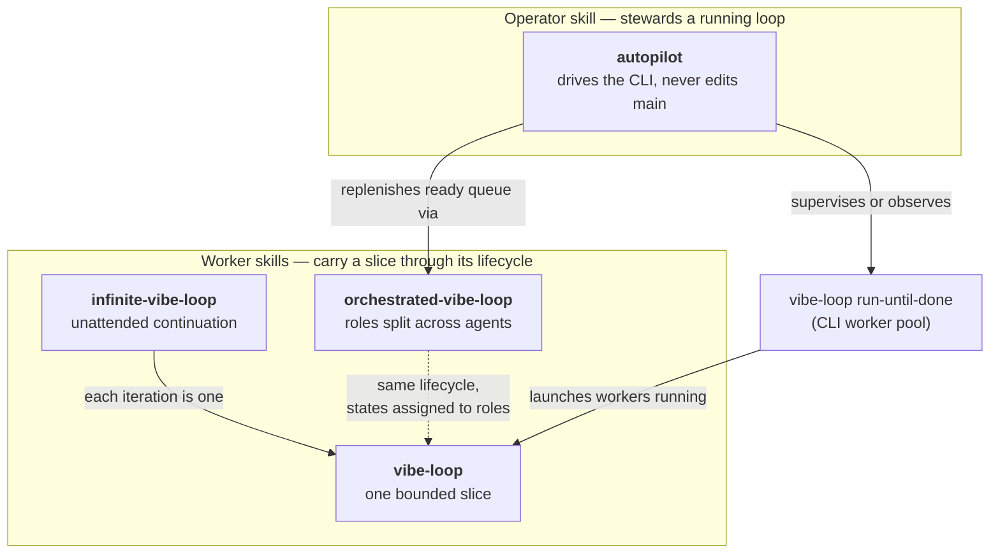

# vibe-loop

`vibe-loop` is a small execution engine for one-slice AI coding loops. It
selects one unblocked task from a repository task source, locks it, runs an
agent command such as `codex exec '$vibe-loop <task_id>'`, captures logs,
validates completion, records local run metadata, and can repeat until no
runnable tasks remain.

The CLI owns task discovery, selection, locks, task workspace provisioning,
process execution, logs, completion checks, and run records. It creates or
safely adopts and claims a dedicated branch/worktree before agent launch. The
configured worker agent owns implementation, review, and any merge-to-`main`
workflow defined by the repository instructions.

The runtime is built around four bundled skills — see [Skills](#skills) — which
also work on their own in Codex or Claude without the CLI.

> [!WARNING]
> `vibe-loop` is in early development. It is not yet well tested or broadly
> reviewed, so treat it as experimental automation and run it only where failed
> commands or incorrect agent behavior cannot damage important work.

## Installation

`vibe-loop` requires Python 3.11 or newer.

Install it as a standalone CLI:

```bash
uv tool install vibe-loop
pipx install vibe-loop
```

Install it into an existing Python environment:

```bash
python -m pip install vibe-loop
```

For unreleased changes, install the current repository state from GitHub:

```bash
uv tool install git+https://github.com/ei-grad/vibe-loop
```

## Quick Start

Point `vibe-loop` at a supported task source. For a small repository, this
Markdown table is enough:

```markdown
| ID | Priority | Status | Dependencies | Scope | Acceptance | Evidence |
| --- | --- | --- | --- | --- | --- | --- |
| TASK-01 | P0 | Next | none | Make one scoped change. | Tests pass. | Not run. |
```

For an existing planning format, generate a repo-specific profile instead:

```bash
vibe-loop tasks configure --repo . --dry-run --json   # review candidate
vibe-loop tasks configure --repo . --json             # activate
```

Inspect work, then run either the named task or one selected task with the
configured agent:

```bash
vibe-loop tasks list --repo .
vibe-loop tasks tree --repo .
vibe-loop next --repo .
vibe-loop run TASK-01 --repo .
vibe-loop run-next --repo .
```

Add `--ask-agent` to delegate selection to the configured selection command
after the mechanically safe candidate list is built:

```bash
vibe-loop run-next --repo . --ask-agent
vibe-loop run-until-done --repo . --ask-agent
```

> [!NOTE]
> Worker commands and direct skill use work best when routine edits, tests,
> reviews, and integration steps do not stop on permission prompts. Configure
> Codex or Claude with a thoroughly scoped allowlist and `dontAsk` mode.

> [!WARNING]
> With permission prompts disabled, any Codex or Claude session — launched
> directly or by a worker command — MUST run in isolation (Docker container or
> VM) with only the required repository, tools, network access, and credentials
> available.

## Skills

The package includes four installable skills — three worker skills and one
operator skill:

- **`vibe-loop`** — one coherent bounded slice. The agent inspects the task,
  edits, verifies, asks for independent review when available, commits,
  integrates to `main` when policy permits, cleans up, and stops.
- **`infinite-vibe-loop`** — unattended continuation across finite slices. After
  each slice it chooses conservative next work, reports blocked paths, and
  continues until stopped.
- **`orchestrated-vibe-loop`** — multi-agent execution where the main agent keeps
  orchestration state and delegates exploration, implementation, and independent
  review without doing the code or review work itself.
- **`autopilot`** — unattended stewardship of the loop. The agent drives
  `vibe-loop run-until-done`, reviews what landed each cycle, troubleshoots
  worker sessions, replenishes the ready queue by invoking `orchestrated-vibe-loop`
  to plan and decompose work, recovers the supervisor from evidence, and sleeps
  between cycles with `vibe-loop wait-helper`. Unlike the worker skills it drives
  the CLI by design, and it never edits the main worktree itself.

The worker skills share one slice lifecycle; the operator skill drives a worker
pool and delegates to them. They compose rather than transition into each other:


```mermaid
flowchart TB
    subgraph workers["Worker skills — carry a slice through its lifecycle"]
        VL["<b>vibe-loop</b><br/>one bounded slice"]
        IVL["<b>infinite-vibe-loop</b><br/>unattended continuation"]
        OVL["<b>orchestrated-vibe-loop</b><br/>roles split across agents"]
    end
    subgraph operator["Operator skill — stewards a running loop"]
        AP["<b>autopilot</b><br/>drives the CLI, never edits main"]
    end

    IVL -->|each iteration is one| VL
    OVL -.->|same lifecycle,<br/>states assigned to roles| VL
    AP -->|supervises or observes| RUD["vibe-loop run-until-done<br/>(CLI worker pool)"]
    RUD -->|launches workers running| VL
    AP -->|replenishes ready queue via| OVL
```

See [docs/skill-work-modes.md](docs/skill-work-modes.md) for the orchestrated
swimlane, the autopilot operator cycle, and a mode-selection guide.

Install them into Codex and/or Claude:

```bash
vibe-loop install-skills --codex --claude
vibe-loop verify-skills
```

From a Git checkout, run installation from clean `main`; dirty and non-mainline
sources are refused by default. Standalone package installations record their
immutable package release provenance instead. The command writes both runtime
directories even when `--codex` or `--claude` filters its report and records
per-file provenance in each target root. `verify-skills` is read-only, exits
non-zero on managed drift, and reports unmanaged paths without treating them as
errors. See [recorded skill deployment](docs/skill-deployment.md) for the
manifest, overwrite guard, classifications, and worker-preflight policy.

The worker skills do not require the CLI; you can invoke them directly for manual
bounded or unattended work. The `autopilot` operator skill does drive the CLI.
The CLI exists when a repository already has a task source and you want
repeatable orchestration: candidate discovery, locks, configured worker
commands, run logs, completion checks, and run metadata.

All three worker skills treat post-integration cleanup as separate from running
the loop, integrating a task, or reporting completion. Effective user and
repository instructions control deletion: an explicit no-delete or
confirmation-required instruction means the worker retains the merged worktree
and local branch, reports the exact worktree path and local branch name, and
still records completion with commit provenance. Only express cleanup
authorization permits removal, and the worker must still verify that the
worktree is clean and merged, ownership is clear, no active agent uses it, and
repository policy permits cleanup.

## Commands

### Tasks

```bash
vibe-loop tasks list --repo .
vibe-loop tasks tree --repo .
vibe-loop tasks inspect QUERY-09 --repo .
vibe-loop tasks runnable --repo .
vibe-loop tasks locks --repo .
vibe-loop tasks configure --repo . --dry-run --json
vibe-loop tasks configure --repo . --force-refresh --json
vibe-loop tasks configure --repo . --promotion-toml
vibe-loop next --repo .
```

`vibe-loop tasks` without a subcommand is a compatibility alias for
`vibe-loop tasks runnable`.

### Run and worker commands

Run orchestration, worker lifecycle, session provenance, recovery, and usage
commands are documented in the [CLI reference](docs/cli-reference.md#run-commands).
The linked PRDs there are authoritative for behavior.

### Status and diagnostics

```bash
vibe-loop workers --repo . --json
vibe-loop runs list --repo .
vibe-loop runs inspect <run-id> --repo .
vibe-loop runs summary --repo . --hours 24 --json
vibe-loop doctor --repo . --json
vibe-loop specs check --repo . --json
vibe-loop --version
```

`runs list` groups records by run id and shows the latest status plus log path;
`runs inspect <run-id>` prints the detailed record history. `vibe-loop
--version` prints the package version; editable source-tree and non-tag Git
installs append `(git <short-sha>)`.

### Evaluation commands

Evaluation invocations are documented in the
[CLI reference](docs/cli-reference.md#evaluation-commands); evaluation methodology
and release policy live in the [skill evaluation strategy](docs/skill-evaluation-strategy.md).

## Autopilot

Autopilot supervises one repository (or a registry of several) and drives
`run-until-done` cycles. Its default worktree policy is report-only: starting
autopilot does not authorize deleting worktrees or branches. It never resets
branches, steals locks, or mutates tracked project files on its own. See
[`docs/prd/autopilot.md`](docs/prd/autopilot.md) for the full contract.

```bash
vibe-loop autopilot status --repo . --json
vibe-loop autopilot run --repo . --once
vibe-loop autopilot run --repo . --once --worktree-disposition reap
vibe-loop autopilot run --repo . --interval 60 --max-cycles 10 --jobs 2
vibe-loop autopilot start --repo . --interval 60 --jobs 2 --json
vibe-loop autopilot reload --repo . --json
vibe-loop autopilot stop --repo . --json
vibe-loop autopilot projects register --repo . --name my-project
vibe-loop autopilot projects register --repo . --name tasks \
  --context LOOPYARD_PROJECT=vibe-loop
vibe-loop autopilot projects status --json
vibe-loop wait-helper --pid 12345 --json
```

### Command backend project binding

A command-backed task source or lock adapter that selects its project from an
ambient environment variable will bind this repository to whatever project the
launching shell happened to point at. Declare the binding instead of exporting
it:

```toml
[project_binding]
require = ["LOOPYARD_PROJECT"]

[project_binding.context]
LOOPYARD_PROJECT = "vibe-loop"
```

`require` lists the namespace selectors this repository's command adapters must
receive. Each one resolves from exactly two explicit sources: the pinned
`[project_binding.context]` above, or the `--context NAME=VALUE` recorded for
this repo in the project registry. A value present only in the ambient
environment does not resolve it — that is the ambiguity this table closes.
Explicit values must contain at least one non-whitespace character.

An ambient value that *disagrees* with the resolved one is refused rather than
ignored. `--repo` selects the repository; the binding selects the project. A
caller who exports `LOOPYARD_PROJECT=other` and runs a command against a
repository bound to `vibe-loop` is asking two different questions at once, and
answering from the binding alone would return this repository's queue, locks,
and supervisor state under the other project's name with nothing in the output
to contradict it. Unset the variable, or point `--repo` at the repository that
variable selects — the diagnostic says so wherever it is reported, including
`autopilot status`, which reports it rather than failing.

The comparison applies only where the caller chose the target. Commands that
enumerate targets from the project registry — `autopilot projects status` and
`autopilot projects inspect` — do not compare it: each entry supplies its own
selector context, one ambient value cannot be a claim about several entries at
once, and refusing per entry would blank most of the aggregate. An ambient value
that is empty or whitespace-only names no project and is treated as absent, so
`LOOPYARD_PROJECT= vibe-loop …` is a way to apply the remedy rather than another
way to trip it.

Supervisor run, start, stop, and stale-recovery operations; task selection;
worker inspection and cleanup; integration locking; and fenced reporting refuse
an unresolved binding *before* invoking a command adapter. The diagnostic names
the variable and the reason (`project_binding_unset:…`,
`project_binding_ambient_only:…`, `project_binding_conflict:…`,
`project_binding_ambient_conflict:…`) and never echoes the value.
`autopilot status` reports the same diagnostics as blockers rather than failing.

`autopilot status --json` includes a `project_binding` block reporting each
required selector's resolved value and whether it came from `config` or
`runtime_context`, so routing is verifiable without reading configuration. It
also lists `injected_names`: every context name handed to adapter subprocesses,
including any that is not required. `autopilot projects status/inspect` reports
the same block; it is the one part of the payload that survives registry-context
redaction, because required names are validated selector-shaped and their values
are the routing fact being checked. Any other declared context name is redacted.

When the binding is unresolved, `autopilot status` does not query the task
source or lock adapter at all — it reports the diagnostic as a blocker and a
`source_error`, rather than showing another project's queue under this repo's
path.

The table is optional. A command backend that already names its project inside
the command string (`loopyard -p vibe-loop task list`) has nothing ambiguous to
close and keeps working with no `[project_binding]` at all.

**`status`** collects a read-only snapshot — queue counts, runnable tasks, active
workers, stale locks, workspace diagnostics, git refs/dirty state, the
main-integration lock, supervisor state, blockers, and the last cycle. It never
starts a worker or mutates state. The `--json` `ProjectStatus` payload is the
machine-readable boundary consumed by external status surfaces such as the
loopyard web UI (board, agents, and timeline screens). Supervisor state
correlates the live supervisor lock with append-only started or observed
records, preserving its run ID, PID, and log even when newer cycle records are
idle and PID-less; `last_cycle` independently reports the newest cycle. A live
supervisor reports `active_cycle` while a cycle is executing and `sleeping`
after the completed cycle records the post-cycle deadline it is honouring.
After a bounded or operator-requested exit, supervisor state is `stopped` while
`last_cycle` retains the independent child-cycle result such as `completed` or
`idle`. `stopped` requires both an explicit terminal stop record and a verified
absence of the recorded process. When those disagree, state is `inconsistent`
and a matching blocker is reported rather than a clean stop:
`autopilot_supervisor_stop_record_live_process` (a stop record whose process is
still running), `autopilot_supervisor_live_without_lock` (a live supervisor that
no longer holds the singleton lock), and
`autopilot_supervisor_exited_without_stop_record` (the process is gone but never
recorded its own termination). A record with no PID at all is likewise
inconsistent — absence cannot be verified against an identity that was never
recorded — and reports `autopilot_supervisor_stop_record_missing_pid` or
`autopilot_supervisor_record_missing_pid`. These blockers surface in the
`ProjectStatus` payload so a stale cycle status cannot mask an unresolved
supervisor. A foreground supervisor writes its own terminal record while it is
still unwinding, so a status sampled inside that short window legitimately
reports `autopilot_supervisor_stop_record_live_process`; re-read status once the
process has exited before treating it as an anomaly.

**`start`** is the supported detached launcher on POSIX systems. It starts the
same foreground `autopilot run` supervisor in a new session with standard input
disconnected and output redirected under the configured state directory. It
returns only after verifying both the process and its matching autopilot lock,
then records and prints the supervisor run ID, PID, process-group ID, session ID,
and log path. A concurrent or repeated start remains fenced by the supervisor
lock. The detached supervisor survives normal caller exit; it is not a boot
service and does not promise restart-on-failure or reboot persistence. When
locks use leases, the foreground supervisor refreshes its own lock throughout
long-running child cycles so a live detached process does not age into stale
status. Use a platform service manager such as systemd, launchd, or a container
orchestrator for those guarantees and for non-POSIX hosts. Plain `nohup ... &`
is not the supported lifecycle because job harnesses may reap child jobs and it
provides no verified process/lock handoff.

**`stop`** gracefully terminates a verified detached supervisor and returns
success only after both its exact process and singleton lock are absent. The
live stop path is Linux-only: it correlates the lock and detached observation's
run ID, PID, process group, session, and kernel process-birth identity, then
uses a pidfd to avoid signaling a reused PID. Unsupported platforms, foreign
hosts, missing observations, identity mismatches, timeouts, interrupted waits,
and backend release failures fail closed without escalating to `SIGKILL` or
stealing a lock. The foreground supervisor handles `SIGINT` and `SIGTERM`
through its normal cleanup, terminates an active child process group, and
releases the lock with its fencing token. A first supported signal starts this
bounded cleanup; repeated `SIGINT`/`SIGTERM` requests are coalesced so they
cannot interrupt fenced lock release and leave a false stale owner.

`stop` also drains the supervisor's own process tree before reporting success.
Signalling only the supervisor would leave its `run-until-done` child, that
child's workers, and any process they detached into a separate session running
under PID 1 — still holding task locks and still burning provider quota after
the operator was told the run stopped. The drain set comes only from this
installation's own records: the child identity the cycle recorded before waiting
on it, the worker-process identity recorded immediately after `Popen`, the
active-run locks in this repository's own lock root, and the process ancestry
rooted at those verified processes. A command lock backend may quarantine the
group, session, and birth fields from its status projection; in that case the
local worker record restores only omitted fields after an exact task, run, PID,
host, and supervisor match. Names, process-group sweeps, and ambient process
listings are never used, so a peer installation's work is never touched.

A worker is verified on its own recorded birth identity, not on its child still
being alive — a worker orphans to PID 1 precisely because that child died, so
that is the case a stop most needs to handle. Every process must present a
matching kernel birth identity before any signal is sent; one live worker this
run cannot attribute or verify blocks the whole stop with nothing signalled,
including when its PID was recycled inside an otherwise verified child tree.
After verification, the supervisor is temporarily stopped through its exact
pidfd so the drained child cannot trigger another cycle. Termination then goes
to exact pidfds, deepest descendants first and the supervisor last. Stop waits
for the exact supervisor's kernel state to acknowledge quiescence; merely
submitting the stop signal is not treated as an acknowledgement. A second
record/lock scan then catches a child created after the first
snapshot, including an initially empty one; resuming the supervisor then lets
its pending termination handler perform normal fenced cleanup. Enumeration,
task-lock reconciliation, descendant drain, supervisor exit, and singleton-lock
release share the caller's original deadline without an added grace period or a
fresh backend timeout.

A timeout, a refused signal, or an interruption reports the exact remaining
role, run, task, and PID instead of a false success, and leaves both the
supervisor record and the task locks untouched so you can verify and retry
against named processes. On success, a worker killed mid-slice is recorded as a
terminated run rather than a completed one: its task lock is released only when
its run, task, and fencing generation all still match what this installation
recorded, while the task itself stays active and its committed worktree is
preserved so the slice can be picked up again. A worker without its own report
receives a terminal non-success run result as well as the terminated lifecycle
transition. A prior same-run `unknown` result does not suppress this explicit
termination result. Any reconciliation blocker makes the overall stop fail,
retains the affected task lock, and suppresses the operator stop record.

If the recorded process is already absent but its lock remains, normal `stop`
reports the stale lock without releasing it. Recovery is a separate explicit
operation:

```bash
vibe-loop autopilot stop --repo . --recover-stale \
  --run-id <exact-supervisor-run-id> --json
```

Recovery requires the exact recorded run and the fencing generation this
installation last successfully acquired, read from a private record under the
lock root rather than from the backend status being recovered. Only a granted
acquire records that generation: a refused `autopilot start` fenced by the stale
lock leaves it untouched, so the operator's natural retry cannot lock recovery
out of the singleton it exists to release. A backend that
reports a generation this installation never issued — another host's lock, or a
lock re-created out of band — fails closed as a fencing mismatch. Recovery also
refuses a live or identity-ambiguous owner, releases through the configured
directory or command backend, and verifies that the lock is gone. The token is
never accepted on the command line or included in output.

A command-backed singleton may record no PID at all — the reported failure was a
lock held with neither lease nor PID. Recovery then derives the exact PID from
this installation's local `autopilot_supervisor_started` record for the
requested run and verifies that exact process is absent before releasing, so the
terminal stop record it writes always carries a verifiable identity. When no PID
exists in either the lock or the local records, recovery fails closed with
`autopilot_stale_recovery_missing_pid`.

**`run`** is a foreground supervisor that launches `run-until-done` as a child
and append-records one `autopilot_cycle` per iteration. Before each launch
decision it cleans only stale task locks whose run is proven finished — the
same validated, audited path as `vibe-loop workers clean --force`. A terminal
`run_result` proves completion. After the stage machine leaves `implementing`,
an absent or birth-mismatched runtime supervisor proves abandonment; a missing
worker does not, because post-report teardown is normal before gates, review,
remediation, integration, and finalization. On Linux, the worker launcher
blocks on an inherited publication pipe before it invokes the configured
command, including commands routed through `/bin/sh`. The supervisor releases
that barrier only after the worker PID is written to the lock and its redundant
durable start event. Before PID publication, recovery therefore requires the
recorded launch barrier plus an absent or birth-mismatched supervisor identity;
supervisor death closes the pipe without letting any worker or shell command
execute. Once the barrier opens, either durable PID source identifies the
worker during implementation, while the exact supervisor identity owns later
runtime stages. A live or identity-ambiguous local run owner fails closed. On
platforms without process-birth identities, a present supervisor PID remains
ambiguous and an absent PID proves abandonment, so post-worker locks remain
recoverable after the supervisor exits. A legacy lockless run is reconstructed
only when its worker-start record falls within one uninterrupted journaled
supervisor generation; a later exit or start for that PID rejects the
association. Legacy pre-worker locks without the publication-barrier proof
remain unsupported, and
`autopilot status` names the offending task and that limitation. Cleanup emits
`lock_expired` records and never deletes worktrees, resets branches, or steals
live runs. Status reconstructs a post-worker live run from its journaled
supervisor identity even if its task lock was lost, so concurrency accounting
does not silently report an idle repository. Each cycle then runs a native
worktree-disposition step and gathers
per-worktree evidence mechanically. The default `report-only` policy journals
eligible candidates without invoking the analysis agent, removing a worktree,
or deleting a branch.
Only an explicit `[autopilot] worktree_disposition = "reap"` setting or
`--worktree-disposition reap` CLI override opts in to automatic disposition.
Under that policy, the read-only analysis agent must return a reasoned reap
decision and the executor still limits removal (`git worktree remove` plus
`git branch -d`) to clean leftovers with one released workspace claim, a
matching completed worker report, and containment in both local and remote
`main` — never the primary worktree, an ambiguous or stale claim, or dirty and
unmerged work-in-progress. Every cycle
journals the configured policy, candidate evidence, reasons, outcomes, and
`worktree_disposition_policy:*`, `worktree_disposition_candidates:N`, and
`reaped_worktrees:N` action tags.
Each cycle also runs a native, read-only disk-health check even when no
`health_command` is configured. It probes the repository and state directory for
free-space and inode pressure against bounded thresholds and journals one
`autopilot_disk_health` record plus a `disk_health:ok|critical` action tag. A
target is only a genuine capacity blocker when both an absolute reserve
(512 MiB free / 10,000 free inodes) and a proportional reserve (2% free) are
exhausted, so a large disk that is proportionally low but has ample bytes, and a
small disk low on bytes but proportionally roomy, are not misreported.
Filesystems that do not expose inode counts skip the inode check. A genuine
capacity blocker withholds launch (`autopilot_disk_capacity_low`); the check
never deletes or truncates anything, and an unreadable path is recorded as a
non-blocking observation rather than a blocker.

Heavy repositories can raise these floors per project without changing the
global defaults (which would create false positives for small/light repos). An
`[autopilot.disk_reserve]` table overrides any of the four floors; an unset
value keeps its native default, and the effective thresholds appear in every
`autopilot_disk_health` record and in `vibe-loop doctor` output:

```toml
[autopilot.disk_reserve]
min_free_bytes = 8589934592        # 8 GiB absolute free-space floor
min_free_fraction = 0.02           # 2% proportional free-space floor
min_free_inodes = 10000            # absolute free-inode floor
min_free_inode_fraction = 0.02     # 2% proportional free-inode floor
```

Values must be non-negative and finite, and fractions must fall in `[0.0, 1.0]`.
Validation resolves each axis to its *effective* pair (the override, or the
native default when unset) and rejects a zero floor paired with a positive one
as contradictory, because a blocker fires only when both floors of an axis are
exhausted. To intentionally disable an axis, zero *both* of its floors; a lone
zero — even against an unset companion that keeps its positive default — is
refused. With the 8 GiB byte floor above, a sample of 3.4 GiB free on a 242 GiB
volume blocks launch even though the native 512 MiB floor would record it as
`ok`.

Each cycle also records a native "what landed" git-log summary even when no
`summary_command` is configured. It reads the previous cycle's recorded `main`
ref (the status carries only the current ref, so the span comes from the prior
`autopilot_cycle` record's `git.main_head`) and journals the commits merged into
`main` since then as one `autopilot_cycle_summary` record plus a
`cycle_summary:landed|unchanged|bootstrap|unavailable:<count>` action tag. The
commit list is bounded (newest first, subjects truncated); a truncated span
appends `+` to the count. The step is read-only and never mutates the
repository. The first cycle has no prior recorded ref and records an empty
`bootstrap` summary rather than walking all of history, and an unresolved
current ref records an `unavailable` summary; neither fails the cycle. A
configured `summary_command` still runs alongside this native summary.

A cycle is still blocked (never force-recovered) when preflight diagnostics are
unsafe: dirty repo, remaining stale locks, unsafe workspace diagnostics, missing
task source, an unavailable agent command, or exhausted disk/inode capacity.
`--once` runs one cycle. Without `--interval`, or with an interval of zero, it
drains runnable work and exits when a cycle is idle or blocked; with a positive
`--interval N` (minimum 60 seconds) it stays resident until `--max-cycles` or an
interrupt. Idle cycles use bounded adaptive task-source rechecks: the first
listing follows
`planning_recheck_seconds` (60s by default), delays double up to
`idle_poll_max_seconds` (600s by default), and the last delay is shortened to
preserve the outer interval deadline. A
default 30-minute empty interval therefore performs five fallback listings, not
roughly 30; each poll derives its runnable set from that single task snapshot.
Task-source command timeouts are shortened to the remaining interval budget so
a failing source cannot overrun the deadline.

Native planning costs provider budget on every launch, so its outcome is
classified and repeated futility is throttled. Two consecutive `invalid_plan`,
`no_tasks`, or `zero_created` outcomes withhold planning for
`planning_backoff_seconds` (six hours by default), and no more than
`planning_max_launches_per_day` launches (four by default) run in a rolling day.
The backoff extends the idle wait rather than blocking it: a task source that
reaches `min_ready` still wakes the next cycle early, stop requests are still
honoured, and `next_wake` reports the deadline the supervisor actually sleeps to.
A persistent cycle schedules that deadline after the child and post-dispatch
checks complete, so child duration is not added to the interval and status does
not retain an already elapsed pre-cycle wake. The wait itself remains duration-
based and monotonic even though the journal exposes an operator-readable UTC
deadline.
A launch that creates tasks, or a materially changed task source, clears the
outcome gate. Created identities and change detection use the complete task
source rather than only its runnable subset, so a new task claimed before the
post-planning read remains productive; lifecycle-only status churn does not
reset the gate. A new fingerprint starts a fresh unproductive epoch and wakes
the real idle waiter even below `min_ready`; unchanged lifecycle/counter state
continues waiting. Only time clears the daily cap, which scans the complete
rolling-day planning history and counts every launch that reached a provider,
including one interrupted before it could record an outcome.
Provider and infrastructure failures stay distinct from `invalid_plan` and never
extend the unproductive streak. `vibe-loop autopilot status` names the
recorded outcome and the backoff reason. Fallback candidate filtering uses
the cycle's active-run/conflict snapshot instead of issuing separately timed
lock-backend queries; lock-only changes wake through the configured adapter or
the outer deadline. Each wait appends an `autopilot_idle_wait` record with the
wake reason, deadline, runnable count, poll/adapter counts, and bounded source
or adapter errors. `--jobs`, `--ask-agent`, `--continue-on-failure`,
`--max-slices`, and
`--max-tasks` are forwarded to each child; `--min-ready` sets the minimum
runnable depth required before launching. The value must be a positive integer;
zero is rejected so an empty queue can never satisfy the launch gate. If the
queue is below that depth and no explicit `[autopilot] planning_command` is
configured, native planning first asks the read-only analysis runner for a
strict decision and objective. A reasoned plan decision launches a separate
read-write `agent.command` worker with an `orchestrated-vibe-loop` planning
prompt; only that worker may author task content. The supervisor never edits the
task source: it journals the decision plus started/terminal worker lifecycle,
honors the configured worker timeout, terminates the worker process group on a
timeout or interrupt, and re-reads runnable depth after the worker exits. Invalid
analysis output fails closed without launching the write-capable worker, and a
post-worker task-source error remains explicit. A configured planning command
retains precedence. A single supervisor lock prevents duplicates; Ctrl-C
terminates the in-flight child and releases the lock.

An explicit `[autopilot] idle_wake_command` can replace clock-only sleeping
between fallback listings with a trusted long-poll adapter. Each invocation is
bounded by the current adaptive delay and receives that delay, the cycle ID,
and outer deadline literally through `VIBE_LOOP_IDLE_WAIT_SECONDS`,
`VIBE_LOOP_IDLE_CYCLE_ID`, and `VIBE_LOOP_IDLE_DEADLINE`. It returns
`{"woke":false}` or `{"woke":true,"reason":"task_change"}`; an
`operator_message` reason may include an `event` object whose `id`, `at`,
`sender`, and `session_ref` metadata are journaled. Message content and adapter
stdout/stderr are not journaled. Invalid, failed, or timed-out adapters are
recorded by error category and use the same adaptive fallback budget, so they
cannot create a spin loop. Adapter stdout is capped at 64 KiB before JSON
parsing, allowed event strings at 1 KiB each, and the journaled event at 4 KiB.
The command is trusted, user-authored configuration;
generated task profiles cannot introduce it. Validated per-project registry
context is copied into this adapter environment using the same literal selector
boundary as task-source and lock adapters.

**`projects`** manages an optional multi-project registry (`register`, `list`,
`remove`, `status`). It records repo paths and display names in a small JSON file
(default `~/.vibe-loop/projects.json`, `--registry` to override); each project
keeps its own state directory. A repeated `register --context NAME=VALUE` option
adds bounded, non-secret selectors for repositories whose command-backed task
source, lock adapter, or idle-wake adapter needs distinct context such as
`LOOPYARD_PROJECT`. A repo that also lists that name in `[project_binding]
require` gets the registry value as its enforced binding.
Selectors are copied literally into only those subprocess environments, never
shell-interpolated or added to global `os.environ`. Names must be selector-
shaped, with suffixes such as `_PROJECT`, `_BOARD`, `_TENANT`, `_WORKSPACE`,
`_NAMESPACE`, `_REPO`, `_TEAM`, or `_SELECTOR`. Secret-like names/values,
loader and shell-startup controls, command lookup paths, credential/config
selectors, and `VIBE_LOOP_*` protocol variables are rejected. Context values
remain only in the registry; `projects list`, `inspect`, and `status` recursively
redact them even if an adapter echoes one in a valid payload or diagnostic.
Existing registry entries without `context` remain valid.
`projects status [--json]` returns one aggregate entry per repo, and a repo that
cannot be read becomes an isolated error entry so one broken project never hides
the others.

Interactive status dashboards (board, agents, and timeline/Gantt screens) live
in the [loopyard](https://github.com/ei-grad/loopyard) web UI, which consumes the
read-only `autopilot status --json` / `projects status --json` boundary. The
former in-tree `autopilot tui` (Textual) and `autopilot webui` surfaces were
removed in favor of loopyard.

The top-level **`vibe-loop wait-helper`** blocks until a watched process exits,
a wall-clock deadline arrives, or an optional message adapter returns a direct
user instruction, or an explicit runtime-event source reports a typed
operator-action-required condition, so an unattended steward can sleep between
cycles.
`--pid` (repeatable) wakes on process exit; `--cycle-schedule [SECONDS]` wakes at
the next UTC `*/SECONDS` boundary; omitting both `--deadline` and
`--cycle-schedule` uses the default 1800s boundary. `--deadline` takes an
explicit ISO-8601 UTC time; `--mode all` waits for every PID. It prints
`wake_reason` (`pid`, `all_complete`, `deadline`, or `message`) with a summary.

`--message-command COMMAND` polls a trusted command that emits
`{"received":false,"message":null}` or a received message containing `id` and
`content`. The recipient comes from `--session-ref` or `VIBE_LOOP_RUN_ID` and is
passed literally as `VIBE_LOOP_WAIT_SESSION_REF`; `--message-timeout` bounds
each poll. For Loopyard-backed projects, the matching adapter is:

```bash
vibe-loop wait-helper --pid 12345 --message-command \
  'loopyard vibe session-message-receive' --session-ref <run-id> --json
```

Loopyard messages are consumed atomically and delivered at most once after the
receive transaction commits. Adapter failures return `wake_reason=adapter_error`
without including command output in the result.

Actionable runtime events use a separate redacted contract. Configure either a
trusted command or the reference run-journal reader, plus a project-scoped
durable cursor:

```bash
vibe-loop wait-helper --pid 12345 \
  --runtime-event-journal .vibe-loop/runs.jsonl \
  --runtime-event-cursor .vibe-loop/wait-runtime.cursor \
  --runtime-event-project my-project --json
```

The only returned event fields are `kind`, stable opaque `id`, `project`,
`run_id`, and `task_id`; unavailable run/task identities are empty. Identifier
values are SHA-256-derived before return so identifier-shaped prompts,
commands, review text, or credentials cannot be echoed. The allowlist covers
operator action, inconsistent
supervision, exhausted recovery, failed lock finalization, disk blockers, and
verified provider quota/account walls. Progress, tool and review traffic,
stage transitions, and successful completion never wake this path. The cursor
is checkpointed before `wake_reason=runtime_event` is returned, preventing a
completed rearm from repeating the same durable event. Adapter failures remain
typed `adapter_error` results; no-adapter behavior and PID/deadline precedence
are unchanged. The cursor checkpoint fsyncs both its content and containing
directory before a wake is returned.

## Configuration

A minimal `.vibe-loop.toml`:

```toml
main_branch = "main"
state_dir = ".vibe-loop"

[agent]
kind = "auto"

[task_source]
type = "markdown-plan"

[orchestration]
mode = "runtime-owned"

[autopilot]
require_clean_repo = true
```

See the [configuration reference](docs/configuration.md) for the annotated
configuration, option index, task-source setup, budgets, routing, locks, and
runtime-owned reviewer configuration.

## Planning Analytics

Planning timeline and Gantt analytics were removed from vibe-loop; those
reporting surfaces now live in the [loopyard](https://github.com/ei-grad/loopyard)
web UI (board, agents, and timeline screens) over the read-only
`autopilot status --json` boundary. See
[`docs/planning-analytics.md`](docs/planning-analytics.md) for the superseded
in-tree contract.

## Local State

Runner state is intentionally untracked:

```text
.vibe-loop/
  locks/
  runs/
  runs.jsonl
```

**Task locks** store the worker `pid`, `task_id`, `run_id`, log path, start time,
base `main` revision, host, resolved command, and optional lease metadata.
`vibe-loop workers` reconstructs the active view from lock files plus
`runs.jsonl` and marks same-host locks with missing processes/PIDs, expired
leases, or incomplete metadata as stale — without reading raw logs. When a worker
claims its workspace, the lock also stores a `workspace` object (branch,
worktree, base commit, HEAD, current branch, dirty state); `workers --json` adds
read-only `workspace_git_state` and `workspace_diagnostics` that flag missing or
duplicate worktrees, already-merged branches, dirty worktrees, and stale
mismatches with manual recovery hints. `doctor --json` summarizes the same
diagnostics. Neither command deletes locks, branches, or worktrees.

**`main-integration.lock`** is a separate advisory lock for worker-owned final
integration (owner task, run id, host, pid, start time), visible through
`vibe-loop main-integration status`. Stale status is diagnostic only.

**`runs.jsonl`** is an append-only stream of versioned run records: result
records carry the `run_id`, `started_at`, resolved `session_id` and source, the
agent `transcript_path` when one is resolved, the agent command/selection
sources, prompt dialect and skill reference sources, and the default agent
policy source. Lifecycle records (`run_started`,
`agent_context_observed`, `agent_started`, `activity_checkpoint`, `gate_result`,
`work_blocked`, `agent_completed`, `run_state_transition`) expose the same
anchor plus bounded trailer-ready context — task IDs for
`Plan-Item`/`Run-Id`/`Session-Id`, agent kind, prompt dialect, and model
provider/ID/reasoning effort when the agent emits them. Activity checkpoints
are coalesced and replay-deduplicated; they update diagnostic projections only
and do not drive worker termination, restart, or task status. `vibe-loop` does
not own commit hooks; repository tooling decides
whether to persist this context into project history. Project worklogs should
remain final evidence ledgers — attempt logs and failed runs belong in
`.vibe-loop/`, not in completion records.

## Spec-Driven Workflow Execution

`vibe-loop` can sit underneath spec-driven development tools as the task
execution layer. Tools such as [Spec Kit](https://github.com/github/spec-kit),
[Kiro](https://kiro.dev/docs/specs/), and [OpenSpec](https://openspec.dev/) own
intent — requirements, design docs, proposals, task lists, approvals.
`vibe-loop` owns repeatable execution: it consumes the task layer, schedules
runnable slices, launches finite workers, captures logs, enforces locks, and
records completion. A spec or PRD is not treated as proof of implementation
unless a task row, worker report, commit reference, test, review, or other
explicit evidence links the contract to completed work.

This repository uses a three-level planning model: `PROMPT.md` (philosophy,
architecture boundaries, PRD-writing rules) → `docs/prd/` (stable `PRD-*`
contracts) → the loopyard `vibe-loop` project (runnable slices with permanent
task IDs). The runtime consumes that board through the repository's configured
command-backed task adapter.

## Relationship to ralphex

`vibe-loop` is inspired by
[umputun/ralphex](https://github.com/umputun/ralphex): a repeatable autonomous
loop that gives coding agents bounded tasks, validates results, and records
progress instead of relying on one long interactive chat. The main differences:

- `ralphex` is plan-file centered; `vibe-loop` is task-source agnostic
  (generated profiles, Markdown tables, explicit plan paths, or command
  adapters) and fits existing project planning instead of requiring a dedicated
  plan directory.
- `ralphex` runs a dedicated plan through task and review phases; `vibe-loop`
  runs one repository backlog slice at a time and merges reviewed slices back to
  `main` frequently.
- `vibe-loop` treats agent execution as configuration (template commands, not a
  hard dependency on one CLI) and keeps workers finite, leaving
  branch/worktree management to the agent.

## Future Plans

The current implementation supports generated task-source profiles,
command-backed sources, dependencies, conflict domains, finite workers, run logs,
structured reports, and skill evals. Planned spec-driven
additions stay below the authoring layer:

- parser presets for Spec Kit, Kiro, OpenSpec, and similar artifacts;
- optional traceability fields on normalized tasks;
- read-only spec coverage and drift checks;
- opt-in execution gates requiring approved, current spec artifacts;
- spec-aware worker prompt context;
- completion evidence mapping requirements to task-source entries, reports,
  trailers, tests, and reviews.

## Development

Install the repository tools with `uv`, then run the standard checks:

```bash
uv sync
uv run python -m unittest discover
uv build
uv run --with twine --no-project -m twine check dist/*
```

The `Makefile` wraps the common release steps:

```bash
make install-hooks
make bump-patch
make bump-minor
make check
make tag
```

`make tag` uses the current `uv version --short` value by default; pass
`VERSION=...` to check or tag an explicit version. The installed `pre-commit`
hook runs `ruff check` and `ruff format --check`; the installed `pre-push` hook
rejects pushed `v*` tags when `pyproject.toml` or the `vibe-loop` entry in
`uv.lock` does not match the tag.

Releases are built by `.github/workflows/release.yml` via PyPI trusted
publishing with the `TestPyPI` and `PyPI` GitHub environments. Run the workflow
manually with target `TestPyPI` for staging; to publish, push a `v<version>` tag
matching `project.version`, or dispatch from that tag with target `PyPI`. Before
publishing bundled skill changes, run the release-readiness gate and put the
record path in the release notes:

```bash
uv run vibe-loop eval release-gate --repo . --overwrite \
  --record-output .vibe-loop/release-readiness.json
```

See [`docs/release-checklist.md`](docs/release-checklist.md) for the checklist
and dry-run record format.

## License

`vibe-loop` is licensed under the MIT License. See [`LICENSE`](LICENSE).
