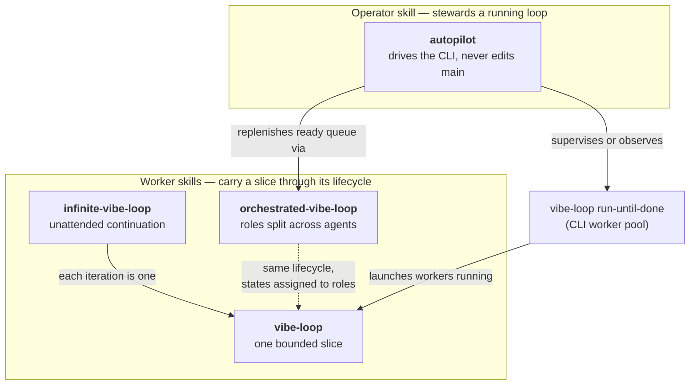

# vibe-loop

`vibe-loop` is a small execution engine for one-slice AI coding loops. It
selects one unblocked task from a repository task source, locks it, runs an
agent command such as `codex exec '$vibe-loop <task_id>'`, captures logs,
validates completion, records local run metadata, and can repeat until no
runnable tasks remain.

The CLI owns task discovery, selection, locks, task workspace provisioning,
process execution, logs, completion checks, and run records. It creates or
safely adopts and claims a dedicated branch/worktree before agent launch. The
configured worker agent owns implementation, review, and any merge-to-`main`
workflow defined by the repository instructions.

The runtime is built around four bundled skills — see [Skills](#skills) — which
also work on their own in Codex or Claude without the CLI.

> [!WARNING]
> `vibe-loop` is in early development. It is not yet well tested or broadly
> reviewed, so treat it as experimental automation and run it only where failed
> commands or incorrect agent behavior cannot damage important work.

## Installation

`vibe-loop` requires Python 3.11 or newer.

Install it as a standalone CLI:

```bash
uv tool install vibe-loop
pipx install vibe-loop
```

Install it into an existing Python environment:

```bash
python -m pip install vibe-loop
```

For unreleased changes, install the current repository state from GitHub:

```bash
uv tool install git+https://github.com/ei-grad/vibe-loop
```

## Quick Start

Point `vibe-loop` at a supported task source. For a small repository, this
Markdown table is enough:

```markdown
| ID | Priority | Status | Dependencies | Scope | Acceptance | Evidence |
| --- | --- | --- | --- | --- | --- | --- |
| TASK-01 | P0 | Next | none | Make one scoped change. | Tests pass. | Not run. |
```

For an existing planning format, generate a repo-specific profile instead:

```bash
vibe-loop tasks configure --repo . --dry-run --json   # review candidate
vibe-loop tasks configure --repo . --json             # activate
```

Inspect work, then run either the named task or one selected task with the
configured agent:

```bash
vibe-loop tasks list --repo .
vibe-loop tasks tree --repo .
vibe-loop next --repo .
vibe-loop run TASK-01 --repo .
vibe-loop run-next --repo .
```

Add `--ask-agent` to delegate selection to the configured selection command
after the mechanically safe candidate list is built:

```bash
vibe-loop run-next --repo . --ask-agent
vibe-loop run-until-done --repo . --ask-agent
```

> [!NOTE]
> Worker commands and direct skill use work best when routine edits, tests,
> reviews, and integration steps do not stop on permission prompts. Configure
> Codex or Claude with a thoroughly scoped allowlist and `dontAsk` mode.

> [!WARNING]
> With permission prompts disabled, any Codex or Claude session — launched
> directly or by a worker command — MUST run in isolation (Docker container or
> VM) with only the required repository, tools, network access, and credentials
> available.

## Skills

The package includes four installable skills — three worker skills and one
operator skill:

- **`vibe-loop`** — one coherent bounded slice. The agent inspects the task,
  edits, verifies, asks for independent review when available, commits,
  integrates to `main` when policy permits, cleans up, and stops.
- **`infinite-vibe-loop`** — unattended continuation across finite slices. After
  each slice it chooses conservative next work, reports blocked paths, and
  continues until stopped.
- **`orchestrated-vibe-loop`** — multi-agent execution where the main agent keeps
  orchestration state and delegates exploration, implementation, and independent
  review without doing the code or review work itself.
- **`autopilot`** — unattended stewardship of the loop. The agent drives
  `vibe-loop run-until-done`, reviews what landed each cycle, troubleshoots
  worker sessions, replenishes the ready queue by invoking `orchestrated-vibe-loop`
  to plan and decompose work, recovers the supervisor from evidence, and sleeps
  between cycles with `vibe-loop wait-helper`. Unlike the worker skills it drives
  the CLI by design, and it never edits the main worktree itself.

The worker skills share one slice lifecycle; the operator skill drives a worker
pool and delegates to them. They compose rather than transition into each other:


```mermaid
flowchart TB
    subgraph workers["Worker skills — carry a slice through its lifecycle"]
        VL["<b>vibe-loop</b><br/>one bounded slice"]
        IVL["<b>infinite-vibe-loop</b><br/>unattended continuation"]
        OVL["<b>orchestrated-vibe-loop</b><br/>roles split across agents"]
    end
    subgraph operator["Operator skill — stewards a running loop"]
        AP["<b>autopilot</b><br/>drives the CLI, never edits main"]
    end

    IVL -->|each iteration is one| VL
    OVL -.->|same lifecycle,<br/>states assigned to roles| VL
    AP -->|supervises or observes| RUD["vibe-loop run-until-done<br/>(CLI worker pool)"]
    RUD -->|launches workers running| VL
    AP -->|replenishes ready queue via| OVL
```

See [docs/skill-work-modes.md](docs/skill-work-modes.md) for the orchestrated
swimlane, the autopilot operator cycle, and a mode-selection guide.

Install them into Codex and/or Claude:

```bash
vibe-loop install-skills --codex --claude
vibe-loop verify-skills
```

From a Git checkout, run installation from clean `main`; dirty and non-mainline
sources are refused by default. Standalone package installations record their
immutable package release provenance instead. The command writes both runtime
directories even when `--codex` or `--claude` filters its report and records
per-file provenance in each target root. `verify-skills` is read-only, exits
non-zero on managed drift, and reports unmanaged paths without treating them as
errors. See [recorded skill deployment](docs/skill-deployment.md) for the
manifest, overwrite guard, classifications, and worker-preflight policy.

The worker skills do not require the CLI; you can invoke them directly for manual
bounded or unattended work. The `autopilot` operator skill does drive the CLI.
The CLI exists when a repository already has a task source and you want
repeatable orchestration: candidate discovery, locks, configured worker
commands, run logs, completion checks, and run metadata.

All three worker skills treat post-integration cleanup as separate from running
the loop, integrating a task, or reporting completion. Effective user and
repository instructions control deletion: an explicit no-delete or
confirmation-required instruction means the worker retains the merged worktree
and local branch, reports the exact worktree path and local branch name, and
still records completion with commit provenance. Only express cleanup
authorization permits removal, and the worker must still verify that the
worktree is clean and merged, ownership is clear, no active agent uses it, and
repository policy permits cleanup.

## Commands

### Tasks

```bash
vibe-loop tasks list --repo .
vibe-loop tasks tree --repo .
vibe-loop tasks inspect QUERY-09 --repo .
vibe-loop tasks runnable --repo .
vibe-loop tasks locks --repo .
vibe-loop tasks configure --repo . --dry-run --json
vibe-loop tasks configure --repo . --force-refresh --json
vibe-loop tasks configure --repo . --promotion-toml
vibe-loop next --repo .
```

`vibe-loop tasks` without a subcommand is a compatibility alias for
`vibe-loop tasks runnable`.

### Run and worker commands

Run orchestration, worker lifecycle, session provenance, recovery, and usage
commands are documented in the [CLI reference](docs/cli-reference.md#run-commands).
The linked PRDs there are authoritative for behavior.

### Status and diagnostics

```bash
vibe-loop workers --repo . --json
vibe-loop runs list --repo .
vibe-loop runs inspect <run-id> --repo .
vibe-loop runs summary --repo . --hours 24 --json
vibe-loop doctor --repo . --json
vibe-loop specs check --repo . --json
vibe-loop --version
```

`runs list` groups records by run id and shows the latest status plus log path;
`runs inspect <run-id>` prints the detailed record history. `vibe-loop
--version` prints the package version; editable source-tree and non-tag Git
installs append `(git <short-sha>)`.

### Evaluation commands

Evaluation invocations are documented in the
[CLI reference](docs/cli-reference.md#evaluation-commands); evaluation methodology
and release policy live in the [skill evaluation strategy](docs/skill-evaluation-strategy.md).

## Autopilot

Autopilot supervises one repository or an optional project registry above
`run-until-done`. Its default worktree policy is report-only; starting it does
not authorize branch or worktree deletion.

- The [Autopilot PRD](docs/prd/autopilot.md) is authoritative for supervision,
  status, recovery, project binding, planning, and wake behavior.
- The [CLI reference](docs/cli-reference.md#autopilot-commands) owns command
  syntax, flags, defaults, and output conventions.
- Interactive board, agent, and timeline views live in the
  [loopyard](https://github.com/ei-grad/loopyard) web UI.

```bash
vibe-loop autopilot status --repo . --json
vibe-loop autopilot run --repo . --once
```

## Configuration

A minimal `.vibe-loop.toml`:

```toml
main_branch = "main"
state_dir = ".vibe-loop"

[agent]
kind = "auto"

[task_source]
type = "markdown-plan"

[orchestration]
mode = "runtime-owned"

[autopilot]
require_clean_repo = true
```

See the [configuration reference](docs/configuration.md) for the annotated
configuration, option index, task-source setup, budgets, routing, locks, and
runtime-owned reviewer configuration.

## Planning Analytics

Planning timeline and Gantt analytics were removed from vibe-loop; those
reporting surfaces now live in the [loopyard](https://github.com/ei-grad/loopyard)
web UI (board, agents, and timeline screens) over the read-only
`autopilot status --json` boundary. See
[`docs/planning-analytics.md`](docs/planning-analytics.md) for the superseded
in-tree contract.

## Local State

Runner state is intentionally untracked:

```text
.vibe-loop/
  locks/
  runs/
  runs.jsonl
```

**Task locks** store the worker `pid`, `task_id`, `run_id`, log path, start time,
base `main` revision, host, resolved command, and optional lease metadata.
`vibe-loop workers` reconstructs the active view from lock files plus
`runs.jsonl` and marks same-host locks with missing processes/PIDs, expired
leases, or incomplete metadata as stale — without reading raw logs. When a worker
claims its workspace, the lock also stores a `workspace` object (branch,
worktree, base commit, HEAD, current branch, dirty state); `workers --json` adds
read-only `workspace_git_state` and `workspace_diagnostics` that flag missing or
duplicate worktrees, already-merged branches, dirty worktrees, and stale
mismatches with manual recovery hints. `doctor --json` summarizes the same
diagnostics. Neither command deletes locks, branches, or worktrees.

**`main-integration.lock`** is a separate advisory lock for worker-owned final
integration (owner task, run id, host, pid, start time), visible through
`vibe-loop main-integration status`. Stale status is diagnostic only.

**`runs.jsonl`** is an append-only stream of versioned run records: result
records carry the `run_id`, `started_at`, resolved `session_id` and source, the
agent `transcript_path` when one is resolved, the agent command/selection
sources, prompt dialect and skill reference sources, and the default agent
policy source. Lifecycle records (`run_started`,
`agent_context_observed`, `agent_started`, `activity_checkpoint`, `gate_result`,
`work_blocked`, `agent_completed`, `run_state_transition`) expose the same
anchor plus bounded trailer-ready context — task IDs for
`Plan-Item`/`Run-Id`/`Session-Id`, agent kind, prompt dialect, and model
provider/ID/reasoning effort when the agent emits them. Activity checkpoints
are coalesced and replay-deduplicated; they update diagnostic projections only
and do not drive worker termination, restart, or task status. `vibe-loop` does
not own commit hooks; repository tooling decides
whether to persist this context into project history. Project worklogs should
remain final evidence ledgers — attempt logs and failed runs belong in
`.vibe-loop/`, not in completion records.

## Spec-Driven Workflow Execution

`vibe-loop` can sit underneath spec-driven development tools as the task
execution layer. Tools such as [Spec Kit](https://github.com/github/spec-kit),
[Kiro](https://kiro.dev/docs/specs/), and [OpenSpec](https://openspec.dev/) own
intent — requirements, design docs, proposals, task lists, approvals.
`vibe-loop` owns repeatable execution: it consumes the task layer, schedules
runnable slices, launches finite workers, captures logs, enforces locks, and
records completion. A spec or PRD is not treated as proof of implementation
unless a task row, worker report, commit reference, test, review, or other
explicit evidence links the contract to completed work.

This repository uses a three-level planning model: `PROMPT.md` (philosophy,
architecture boundaries, PRD-writing rules) → `docs/prd/` (stable `PRD-*`
contracts) → the loopyard `vibe-loop` project (runnable slices with permanent
task IDs). The runtime consumes that board through the repository's configured
command-backed task adapter.

## Relationship to ralphex

`vibe-loop` is inspired by
[umputun/ralphex](https://github.com/umputun/ralphex): a repeatable autonomous
loop that gives coding agents bounded tasks, validates results, and records
progress instead of relying on one long interactive chat. The main differences:

- `ralphex` is plan-file centered; `vibe-loop` is task-source agnostic
  (generated profiles, Markdown tables, explicit plan paths, or command
  adapters) and fits existing project planning instead of requiring a dedicated
  plan directory.
- `ralphex` runs a dedicated plan through task and review phases; `vibe-loop`
  runs one repository backlog slice at a time and merges reviewed slices back to
  `main` frequently.
- `vibe-loop` treats agent execution as configuration (template commands, not a
  hard dependency on one CLI) and keeps workers finite, leaving
  branch/worktree management to the agent.

## Future Plans

The current implementation supports generated task-source profiles,
command-backed sources, dependencies, conflict domains, finite workers, run logs,
structured reports, and skill evals. Planned spec-driven
additions stay below the authoring layer:

- parser presets for Spec Kit, Kiro, OpenSpec, and similar artifacts;
- optional traceability fields on normalized tasks;
- read-only spec coverage and drift checks;
- opt-in execution gates requiring approved, current spec artifacts;
- spec-aware worker prompt context;
- completion evidence mapping requirements to task-source entries, reports,
  trailers, tests, and reviews.

## Development

Install the repository tools with `uv`, then run the standard checks:

```bash
uv sync
uv run python -m unittest discover
uv build
uv run --with twine --no-project -m twine check dist/*
```

The `Makefile` wraps the common release steps:

```bash
make install-hooks
make bump-patch
make bump-minor
make check
make tag
```

`make tag` uses the current `uv version --short` value by default; pass
`VERSION=...` to check or tag an explicit version. The installed
`commit-msg` hook adds `Plan-Item`, `Run-Id`, and `Agent-Kind` trailers
to commits made by a vibe-loop worker. A `prepare-commit-msg` fallback preserves
those trailers when `git commit --no-verify` bypasses `commit-msg`. The installed
`pre-commit` hook runs
`ruff check` and `ruff format --check`; the installed `pre-push` hook rejects
pushed `v*` tags when `pyproject.toml` or the `vibe-loop` entry in `uv.lock`
does not match the tag.

Releases are built by `.github/workflows/release.yml` via PyPI trusted
publishing with the `TestPyPI` and `PyPI` GitHub environments. Run the workflow
manually with target `TestPyPI` for staging; to publish, push a `v<version>` tag
matching `project.version`, or dispatch from that tag with target `PyPI`. Before
publishing bundled skill changes, run the release-readiness gate and put the
record path in the release notes:

```bash
uv run vibe-loop eval release-gate --repo . --overwrite \
  --record-output .vibe-loop/release-readiness.json
```

See [`docs/release-checklist.md`](docs/release-checklist.md) for the checklist
and dry-run record format.

## License

`vibe-loop` is licensed under the MIT License. See [`LICENSE`](LICENSE).
