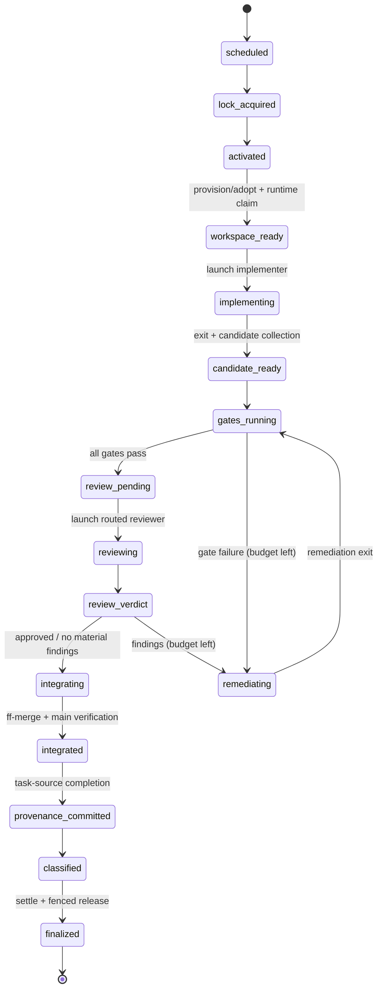

# Deterministic Run Orchestration Plan

This is the reviewed refactoring plan for moving orchestration of
implementation and review from the model-interpreted worker prompt into the
deterministic `vibe-loop run` runtime. It is the Level 2/3 planning deliverable
for the `plan-deterministic-run-orchestration` task; it does not implement the
refactor. Contract requirements extracted from this plan live in
`docs/prd/run-orchestration.md` (`PRD-ORC-*`). The implementation decomposition
at the end is mirrored in the Loopyard `vibe-loop` project task graph.

## Objective

Today `vibe-loop run` owns a thin deterministic shell (locks, activation,
process launch, classification, settlement) around one large model-owned blob:
the worker prompt asks the agent to create its workspace, implement, run gates,
launch its own reviewer, interpret findings, remediate, re-review, integrate to
`main`, update the task source, and report. The intended boundary is lower:

- `vibe-loop run` owns one complete bounded task lifecycle deterministically.
- `run-until-done` owns queue selection and bounded parallel scheduling of
  independent `run` instances.
- `autopilot` owns health, recovery, and planning policy above both.
- Skills own adaptive intent and judgment *inside* runtime-owned stages, not
  the lifecycle transitions themselves.

## Current-State Flow Map

Grounded in the implementation as of this plan (references are indicative, not
line-stable).

### Deterministic today (runtime-owned)

`VibeRunner.run_task` (`src/vibe_loop/runner.py`) executes, in order:

1. **Spec gate** — `ensure_spec_execution_gate` (spec drift/approval gates).
2. **Agent resolution** — `resolve_task_agent` (`src/vibe_loop/config.py`):
   task `agent` field → `[[agent.routing]]` rules → default `[agent]`; task
   `model` override; profile command/model/effort come from config.
3. **Run identity** — `new_run_id`, log path under `state_dir/runs/`,
   `start_main`/`base_main` refs.
4. **Session identity injection** — `inject_claude_session_id` /
   `inject_claude_resume` for resumable continuation,
   `inject_structured_usage_output`; Codex has no session injection
   (documented `fallback:run_id`).
5. **Prompt construction** — `build_run_worker_prompt`: skill reference +
   `CLI_WORKER_ADDENDUM` + traceability/spec context + recovery section +
   `[agent].worker_prompt_extra`.
6. **Task lock** — `acquire_scheduled_task_lock` with `ActiveRunState`
   metadata; fencing token exported to the worker environment.
7. **Activation** — `activate_task_before_launch`: command-backed
   `task_source.activate` compare-and-set (runnable → in-progress), confirmed
   before launch; failure releases the exact lock and launches nothing.
8. **Worker launch** — `run_streaming_command`: `Popen`,
   `worker_process_started` identity record, streamed observation of session
   id / model context / provider usage, reap watchdog after a filed terminal
   report, wall-clock timeout.
9. **Collection** — transcript resolution, usage parsing, worker report
   lookup (`RunStore.latest_worker_report`), completion checks
   (`[completion].commands`) only when exit 0 and no report.
10. **Classification** — `classify`: `timed_out` → worker report status →
    limit-wall scan → exit code → task-source probe (`done` → `completed`,
    blocked family → `blocked`, main moved and task gone → `completed`) →
    `unknown`.
11. **Settlement** — durable `RunResult` append, settled outcome published
    onto the lock row, fenced `release_settled`, `lock_released` event
    (`PRD-WRK-003` finalization gate).

`run_until_done_serial`/`run_until_done_parallel` add: candidate listing and
conflict-domain filtering, agent-assisted batch selection, restart budgets and
cooldowns, limit-wall dispatch pause plus `task_source.reset` hook, timeout
skip, and bounded unknown-run recovery (`drive_unknown_recovery` →
`recover_unknown_run` → continuation worker with `RecoveryContext`, resuming
the prior Claude session when possible).

`autopilot` supervises `run-until-done` as a child, owns stale-lock recovery,
disk health, landed summaries, worktree disposition, native planning, and the
verified stop/drain machinery.

### Model-owned today (prompt-interpreted)

Everything between activation and classification is prose in
`CLI_WORKER_ADDENDUM`, skill text, and `worker_prompt_extra`, interpreted by
the implementation agent:

- branch/worktree creation or adoption, and `worker claim-workspace`;
- implementation and candidate stabilization;
- running gates (tests, lint, drift checks) and judging their results;
- launching the reviewer (`codex review ...` or another command) from its own
  shell, interpreting findings, remediating, re-reviewing;
- `main-integration acquire/release`, merge from `main`, fast-forward to
  `main`, verification on `main`;
- task-source completion transition (e.g. `loopyard task transition ... done`);
- `vibe-loop report` with the terminal status.

### Observed failure modes (evidence)

- A worker mutated the primary `main` worktree before creating a branch or
  claiming a workspace (run `20260721T093204Z-AUTO-16-400e74d9`); the
  dedicated-worktree invariant was prompt-only.
- A timed-out review was relaunched as a brand-new reviewer session; initial
  review and targeted closure ran as two unrelated `codex review` sessions
  with no `resume`, no model/effort selection, and no usage attribution (runs
  documented in `run-until-done-supervisor-review-routing`).
- Reviewer model/effort/concurrency are invisible to and uncontrolled by the
  runtime; review time is indistinguishable from implementation time.
- Review continuity and budget depend on the implementer's shell behavior and
  on the model reading prose correctly.

## Target Architecture

### Ownership rule

A model session may *propose* (a candidate, findings, a remediation, an
escalation, a gate list) but only the runtime *transitions*. Model sessions
mutate lifecycle state exclusively through explicit fenced runtime commands
that validate against the active task lock and fencing token; everything else
they emit is input to a deterministic decision, recorded in the journal.

### Target state machine

One `vibe-loop run` drives one task lifecycle through explicit stages. States
extend the derivable run lifecycle of `PRD-WRK-010`; every transition appends a
durable event before its effect is acted on (journal-ahead), so the machine is
reconstructable after process death at any boundary.



Failure transitions exist from every stage and are typed, not collapsed:

- `limit_wall(stage, route)` — provider wall on the implementer or reviewer
  route; pauses only that route, never converts into blind retries.
- `timed_out(stage)` — stage wall-clock timeout; kills the stage process
  group, preserves the workspace, returns the task per current semantics.
- `stage_failed(stage, reason)` — deterministic failure (gate exhausted,
  malformed reviewer output after bounded re-ask, integration conflict).
- `blocked(reason)` — worker-reported or runtime-detected external gate.
- `cancelled` — SIGTERM/SIGINT: terminate stage subprocess group, journal,
  fenced release, workspace preserved.
- `crashed` — no event written; derived on resume from the journal prefix.

Recovery: `run` (or the scheduler's unknown-run recovery) resumes from the
last journaled stage instead of restarting the whole lifecycle from scratch.
A crash between an effect and its confirmation event resolves by
re-inspection (e.g. integration verified by ref comparison, activation by
task-source probe), never by assuming success.

### Component responsibility table

Every state mutation and external process launch has exactly one named owner.
New components live in a new `src/vibe_loop/orchestration.py` (state machine +
stage records) unless noted; existing components keep their current homes.

| Transition / effect | Owner (component) |
| --- | --- |
| Task selection, slot refill, conflict filtering | `VibeRunner.run_until_done_*` (scheduler) |
| Task lock acquire/heartbeat/fenced release | `LockManager` (existing) |
| Activation CAS + confirmation | `VibeRunner.activate_task_before_launch` (existing) |
| Run contract resolution + recording | `RunContractResolver` (new) |
| Workspace provision/adopt/claim | `WorkspaceProvisioner` (new; helpers from `workers.py`) |
| Implementer/reviewer process launch, stream observation, timeout, termination | `run_streaming_command` + `StageLauncher` wrapper (new) |
| Candidate collection and validation | `CandidateCollector` (new) |
| Gate execution + evidence records | `GateRunner` (new; generalizes `run_completion_checks`) |
| Reviewer routing, concurrency budget, continuation | `ReviewRouter` (new) |
| Findings-ledger persistence and verdict validation | `ReviewRouter` + `RunStore` |
| Remediation/closure budgets | orchestration state machine |
| Integration lock, merge, ff, main verification | `Integrator` (new; uses `LockManager.acquire_main_integration_with_wait`) |
| Task-source completion transition | `TaskSourceCompleter` (new; `task_source.complete` adapter) |
| Classification, durable result, settlement | `VibeRunner.classify` / `record_result` / `settle_outcome_and_release` (existing) |
| Unknown-run recovery driver | `VibeRunner.drive_unknown_recovery` (existing, extended to stage-aware resume) |

The fenced worker-facing CLI surface (`vibe-loop report`,
`worker claim-workspace` in compat mode, plus new `worker candidate` and
review-verdict ingestion) remains the only model-writable path into lifecycle
state, and every command validates lock ownership and fencing token.

## Durable Event And Provenance Schema

All new record types are additive under the `PRD-WRK-009` rules
(`schema_version`, `record_type`, `occurred_at`, `run_id`, `task_id`,
unknown-type tolerance, no secrets/fencing tokens, no raw command strings).

New record types:

- `run_contract_resolved` — the resolved contract (below) with source
  identities and digest; appended after activation and before any workspace
  or repository mutation.
- `workspace_provisioned` — mode (`created` | `adopted` | `preserved`),
  branch, worktree path, base commit, prior-state evidence for adoption;
  the runtime-authored `workspace_claim` follows it.
- `stage_transition` — generalization of `run_state_transition` for the new
  stages (`from_stage`, `to_stage`, `reason`, ordinal for repeated stages).
- `gate_result` — gate id/command identity (redacted to configured key),
  exit class, duration, log reference, evidence digest.
- `candidate_recorded` — head commit, base main, changed paths summary,
  declaration source (`worker_command` | `derived`).
- `review_started` / `review_verdict` — pass kind (`initial` |
  `closure:<n>`), route (provider/model/effort/source), session identity and
  continuation info, verdict, findings count, usage stats.
- `finding_recorded` — one entry per finding: stable finding id, severity,
  summary, files, state (`open` | `remediated` | `accepted` | `rejected`),
  closure evidence reference. The set of these records for a run is the
  findings ledger.
- `continuation_fallback` — a route that should have resumed a session but
  could not (provider unsupported, transcript missing); reason recorded.
- `integration_result` — merged ref movement, verification evidence,
  no-op case (`branch_already_merged`).
- `task_provenance_committed` — task-source completion adapter result.

Ordered invariants (each later item requires the durable record of every
earlier one; recovery re-derives position from this order):

1. lock acquired → 2. activation confirmed → 3. contract resolved →
4. workspace provisioned + claimed → 5. implementer launched →
6. candidate recorded → 7. gates passed → 8. review verdict recorded →
9. integration result → 10. task provenance committed →
11. durable `RunResult` → 12. settled outcome published → 13. fenced release.

The existing `PRD-WRK-003` settlement gate (11→12→13) is preserved unchanged.

## Typed Stage Contracts

### Run contract (resolved before mutation)

A versioned document resolved by `RunContractResolver` from repository config
plus (optionally) a skill/profile proposal, validated against a schema, and
recorded as `run_contract_resolved` before any mutation:

```json
{
  "contract_version": 1,
  "mode": "runtime-owned | worker-owned",
  "source": {"kind": "config|profile|skill-proposal", "id": "...", "digest": "sha256:..."},
  "implementer": {"profile": "...", "provider": "...", "model": "...", "effort": "...", "timeout_seconds": 0},
  "reviewer": {"profile": "...", "provider": "...", "model": "...", "effort": "...", "timeout_seconds": 0,
               "max_initial_passes": 1, "max_closure_passes": 2, "concurrency_budget": 1},
  "gates": [{"id": "tests", "command_key": "completion.commands[1]"}],
  "integration": {"enabled": true, "verify_on_main": ["..."]},
  "task_provenance": {"complete_adapter": "task_source.complete"},
  "remediation": {"max_rounds": 2}
}
```

Repository policy becomes validated runtime input: gate commands, reviewer
routes, and budgets are allowlisted/typed configuration keys, never arbitrary
lifecycle shell handed to a model.

### Implementer stage I/O

Launch input (environment + prompt context, all runtime-produced): task
identity and body, run id, provisioned workspace path and branch, contract
digest, stage (`implement` | `remediate:<n>`), open findings for remediation,
resume session id when continuing.

Collected output (typed, validated): exit class (ok / transient / limit-wall
with reset evidence / timeout / fatal), session identity
(`session_id`, `session_id_source`, transcript path), provider-native usage,
worker report if filed, candidate declaration — via a new fenced
`vibe-loop worker candidate --head <sha> ...` command or derived by
`CandidateCollector` from the claimed branch (head commit, changed paths vs
`base_main`) when the worker did not declare one.

### Reviewer stage I/O

Launch input (`ReviewRequest`, serialized for the reviewer command):
run/task identity; candidate identity (branch, base main, head commit,
changed-path list, diff source); gate evidence references; review policy
references from the contract (e.g. `REVIEW.md`, rubric text); pass kind
(`initial` | `closure:<n>`); on closure passes, the open findings ledger
entries to verify.

Collected output (`ReviewResult`, schema-validated): verdict (`approve` |
`findings` | `error`), findings list (id, severity, summary, evidence,
files/lines), session identity and continuation ordinal, native usage, retry
classification. Malformed output gets one bounded deterministic re-ask, then
`stage_failed(review, malformed_output)` — never silent acceptance.

Delivery mechanism: reviewer commands are configured templates like agent
commands today; the runtime passes the request via file/stdin and requires
schema-conforming output (mirroring the analysis-agent strict-JSON path),
falling back to a fenced ingestion command for reviewers that cannot emit
structured output directly.

### Retry classification (shared)

Every stage subprocess result is classified once, in the runtime, into:
`ok`, `transient` (bounded jittered retries), `limit_wall` (typed, reset
evidence, no retries, per-route pause — reusing `retry.py`),
`timeout`, `fatal`. A typed provider limit on the reviewer route must pause
that route only; it must not consume the task restart budget or convert into
implementation retries.

## Reviewer Routing, Continuation, And Budgets

- `[review]` (or `[agent.review]`) config selects the reviewer route —
  profile/provider/model/effort/command — independently from the implementer,
  with the same validation as agent profiles. A repository-mandated review
  command (e.g. `codex review`) becomes a typed reviewer route, not a prose
  instruction to the implementer.
- Reviewer concurrency is budgeted separately from `--jobs` (implementation
  slots). `jobs=1` keeps meaning one implementation task per project.
- Continuation: remediation resumes the same implementer session and targeted
  closure resumes the same reviewer session whenever the provider supports it
  (Claude: `--resume <session-id>`; Codex: no supported non-JSON resume for
  `codex exec`/`codex review` today). When resume is unsupported or the
  transcript is gone, the runtime records `continuation_fallback` with the
  reason and passes the prior findings ledger and session artifacts as
  explicit context instead — the fallback is recorded, never silent.
- Budgets are runtime-enforced: at most the contract's initial passes plus
  closure passes per stable candidate; a materially changed candidate (new
  commits beyond remediation of recorded findings) may reset the budget only
  through an explicit journaled decision.
- Status (`workers`, `runs inspect`, autopilot status) exposes whether a task
  is implementing, reviewing, remediating, or integrating, with per-stage
  timestamps derived from `stage_transition` records.

## Quota Accounting

Usage stats (PRD-AUT-016) gain a runtime-assigned `phase` per stage:
`implementation`, `initial_review`, `remediation`, `targeted_closure`,
plus existing `discovery`/`planning`. The runtime stamps the phase from the
state machine — it no longer trusts the worker report's self-declared phase in
runtime-owned mode (the report value is kept as corroborating metadata).
Limit walls are attributed to the route and phase that hit them, so rolling
summaries can distinguish implementer spend from reviewer spend and a
reviewer-route wall never reads as implementation failure.

## Skill / Runtime Composition

Eliminating duplicated policy is a non-goal. A rule may deliberately exist as
skill guidance (portable, teachable, interactive) and as a runtime invariant
(enforced, recoverable); the composition below is justified by behavior and
operator ergonomics.

### Boundary

- **Skills (adaptive layer):** task interpretation, repository-specific
  workflow constraints, evidence and gate *selection* judgment, review
  rubrics, remediation judgment, escalation points, user-facing synthesis.
  Skills remain self-sufficient workflow contracts that work with no
  supervisor at all (Level 1 rule preserved: no CLI commands or `VIBE_LOOP_*`
  in skill files).
- **Runtime (deterministic layer):** workspace/lock ownership, lifecycle
  transitions, process launch/collection, provider/model/effort routing,
  concurrency and quota budgets, timeout/retry classification,
  findings-ledger persistence, integration, provenance, recovery.

### Mechanisms compared

1. **Versioned run contract/profile selected or proposed by a skill.** A
   skill (or repo config) yields a declarative contract; the runtime
   validates, records, and executes it. + Durable provenance, schema
   validation, natural config precedence, works identically for interactive
   proposals and supervised runs. − One more artifact to version; expressive
   ceiling is deliberate.
2. **Typed stage adapters/hooks.** Config maps each stage to a command with
   typed JSON I/O; skills are prompts inside stages. + Maximum flexibility
   per stage; mirrors existing task-source/lock adapter pattern. − Alone, it
   re-scatters policy across hook commands and does not give a single
   recorded pre-mutation policy artifact.
3. **Declarative workflow manifest** (skill- or repo-authored stage graph the
   runtime interprets). + Most expressive. − Reintroduces prompt-defined
   lifecycle with extra steps: the graph itself becomes unvalidated policy,
   the test matrix explodes, and acceptance-critical ordering again depends
   on an author getting a document right per repository.

### Selection

**Hybrid of 1 + 2: a fixed runtime state machine, parameterized by a
versioned run contract, whose stage boundaries are typed adapters.** The
stage *graph* is code (deterministic, tested once); the stage *content*
(which gates, which reviewer route, which budgets, which rubric) is the
validated contract; the stage *executors* (implementer command, reviewer
command, gate commands, task-source adapters) are typed, allowlisted
configuration. Option 3 is rejected: a repository that genuinely needs a
different lifecycle shape should run worker-owned mode (kept during
migration) or propose a runtime change, not smuggle a new lifecycle through a
manifest.

The resolved contract is recorded before mutation and carries skill/profile
identity and version or digest, so a proposal-producing skill is a
first-class, attributable input without ever being the transition owner.

### Operating modes and degradation

- **Interactive (no supervisor):** skills alone still carry the full loop —
  including gates, review discipline, and integration guidance — exactly as
  today. Deliberate overlap with runtime invariants is retained on purpose.
- **Supervised (`vibe-loop run`):** the worker prompt shrinks: the addendum
  tells the implementer what the runtime owns (workspace already provisioned
  and claimed; do not launch reviewers; declare the candidate; report via
  fenced commands) instead of teaching the whole lifecycle. The skill's
  judgment sections still apply inside the implementation stage.
- **Missing skill / version skew:** the contract records the skill reference
  the prompt used; a missing or mismatched skill is a diagnostic, and
  acceptance-critical ordering never depended on it.
- **Changed repository policy mid-flight:** the recorded contract governs the
  run to completion; the next run re-resolves.
- **Partially supported providers:** capability table per provider (session
  injection, resume, structured output); unsupported capabilities produce
  recorded fallbacks, not silent degradation.
- **Legacy runs:** journals without the new record types are worker-owned
  runs; recovery treats them under current semantics and never reinterprets
  them as runtime-owned.

Tests must prove a skill or model response cannot bypass workspace, review,
quota, provenance, or integration invariants (a "malicious/confused worker"
fixture suite), while a proposal-producing skill can still change gates,
rubric, and budgets through the validated contract.

## Migration And Compatibility

Config: `[orchestration] mode = "worker-owned" | "runtime-owned"`, default
`worker-owned` until the flip slice. The active mode and contract are recorded
per run, so mixed histories stay interpretable. Generated profiles cannot set
orchestration keys (same rule as other executable-adjacent config).

Phases (each independently shippable; worker-owned mode keeps working
throughout, and no repository review policy is silently weakened — a repo's
mandated reviewer becomes an enforced route before the prose that mandated it
is removed):

- **Phase 0 — contracts and journal.** Contract resolver + record types +
  stage-transition derivation in shadow mode around the existing lifecycle
  (no behavior change; new events observed from existing hooks).
- **Phase 1 — workspace pre-provisioning** (absorbs
  `run-until-done-preprovision-worker-worktree`): provision/adopt before
  launch, runtime-authored claim, fail-closed preservation of dirty or
  ambiguous existing work, primary-worktree non-mutation invariant.
- **Phase 2 — runtime gates and candidate collection.**
- **Phase 3 — reviewer routing/lifecycle/continuation** (absorbs
  `run-until-done-supervisor-review-routing`).
- **Phase 4 — runtime integration + task provenance adapter.**
- **Phase 5 — scheduler separation and prompt slimming** (run-until-done
  schedules `run` lifecycles; addendum shrinks in runtime-owned mode).
- **Phase 6 — default flip** to runtime-owned; worker-owned remains a
  documented compatibility mode with explicit provenance; removal is a later
  decision once evidence shows no repository depends on it.

Compatibility specifics:

- **Codex and Claude, both roles:** the capability table drives injection,
  resume, and structured output per provider; Codex reviewer continuation is
  an explicit recorded fallback until the CLI supports it.
- **Command-backed Loopyard tasks:** `task_source.activate` already exists;
  a new optional `task_source.complete` adapter lets the runtime own the
  done-transition. Without it, completion stays worker-owned (or manual) and
  the runtime records that provenance was external — mirroring activation's
  introduction.
- **Existing run journals:** all new types are additive; existing readers
  ignore them; `derive_run_lifecycle` gains stages only for runs that
  recorded them.
- **In-flight legacy recovery:** unknown-run recovery keeps its current
  contract for runs without stage records; stage-aware resume applies only to
  runs that journaled stages.

## Verification Strategy

- **Deterministic state-machine tests:** every legal transition, every typed
  failure transition, and every illegal-transition rejection, with stub stage
  executors (no real agents/git where injectable).
- **Crash recovery at every boundary:** parametrized kill-between-events
  tests — after each of the 13 ordered invariants — asserting resume lands in
  the correct stage, never duplicates an effect (activation CAS, claim,
  merge, completion adapter), and never loses the durable-result-before-
  settlement gate.
- **Process supervision:** stage subprocess-group termination on timeout and
  cancel; reap watchdog behavior per stage; no orphaned reviewer processes.
- **Provider walls:** fixtures for implementer-route and reviewer-route walls
  (with and without reset evidence) proving no retry consumption, per-route
  pause, and correct phase attribution.
- **Reviewer continuity:** same-session closure on resume-capable providers;
  recorded `continuation_fallback` otherwise; budget exhaustion behavior;
  malformed reviewer output re-ask then typed failure.
- **Isolation:** `jobs=1` — one implementation lifecycle, reviewer budget
  independent; `jobs=2` — distinct worktrees, no primary-worktree claim,
  conflict domains still enforced, reviewer concurrency budget shared
  correctly.
- **Primary worktree non-mutation:** byte-for-byte comparison of the primary
  worktree across a full runtime-owned lifecycle (except intended `main` ref
  movement at integration).
- **Invariant-bypass suite:** worker fixtures that try to claim the primary
  worktree, mutate task-source status, over-spend review budget, or inject
  lifecycle transitions via output text — all must be rejected and journaled.
- **Compatibility:** worker-owned mode regression suite stays green
  throughout; mixed-journal readers; legacy recovery fixtures.
- **Eval layer:** local-demo user stories for the runtime-owned flow
  (Phase 5+) mirroring the existing workspace/integration regression cases.

## Implementation Decomposition

Dependency-ordered, independently reviewable slices. `ORC-*` IDs are the
stable implementation-slice IDs; the Loopyard `vibe-loop` project carries the
dispatchable tasks (keys in parentheses). The two existing on-hold tasks are
re-scoped into this sequence rather than duplicated.

| ID | Task key | Depends on | Scope |
| --- | --- | --- | --- |
| ORC-01 | `plan-deterministic-run-orchestration` | — | This reviewed plan, `PRD-ORC-*`, and the task-graph reconciliation. |
| ORC-02 | `orc-run-contract-record` | ORC-01 | `[orchestration]` config parsing (mode, reviewer route ref, budgets), `RunContractResolver`, `run_contract_resolved` record, generated-profile prohibition, provenance in `run_started`. No lifecycle behavior change. |
| ORC-03 | `orc-lifecycle-state-machine` | ORC-02 | `orchestration.py` state machine + `stage_transition`/typed failure records in shadow mode around the existing lifecycle; `derive_run_lifecycle` extension; `runs inspect`/`workers` stage display. |
| ORC-04 | `run-until-done-preprovision-worker-worktree` (re-scoped) | ORC-03 | `WorkspaceProvisioner`: provision/adopt + runtime claim before launch, fail-closed dirty/ambiguous preservation, unwind without lock leaks, jobs=2 distinct worktrees, primary-worktree invariant. Covers `PRD-ORC-003`. |
| ORC-05 | `orc-runtime-gates` | ORC-04 | `GateRunner` + `gate_result` evidence, `CandidateCollector` + `worker candidate` fenced command, remediation loop budget for gate failures. |
| ORC-06 | `run-until-done-supervisor-review-routing` (re-scoped) | ORC-05 | `ReviewRouter`: `[review]` route config, `ReviewRequest`/`ReviewResult` typed I/O, findings ledger records, verdict validation, reviewer concurrency budget, per-route limit walls, stage-phase usage attribution. Covers `PRD-ORC-005/006/008`. |
| ORC-07 | `orc-reviewer-continuation` | ORC-06 | Same-session remediation/closure resume where supported; provider capability table; `continuation_fallback` records; budget semantics for changed candidates. |
| ORC-08 | `orc-runtime-integration` | ORC-05, ORC-06 | `Integrator`: integration-lock window, merge-from-main, verification, ff-merge, main verification, no-op merged case, `integration_result`. |
| ORC-09 | `orc-task-provenance-completion` | ORC-08 | `task_source.complete` adapter + `TaskSourceCompleter`; ordering invariant (integration → provenance → report); compat when unconfigured. |
| ORC-10 | `orc-scheduler-separation` | ORC-07, ORC-09 | `run-until-done` schedules `run` lifecycles only; supervised-mode addendum slimming; skill-package updates for both operating modes; invariant-bypass test suite. |
| ORC-11 | `orc-migration-default-flip` | ORC-10 | Default `runtime-owned`; migration docs; worker-owned mode regression matrix pinned; eval/demo stories; removal criteria documented (not executed). |

Review budget note per slice: each slice ships with focused tests plus one
independent review per repository policy; the invariant-bypass and
crash-recovery suites are acceptance-critical for ORC-04/05/06/08.

## Non-Goals

- No central multi-repo merge queue; integration stays per-task under the
  advisory lock.
- No workflow-manifest interpreter (rejected above).
- No removal of skills or of the interactive operating mode; skills remain
  the portable workflow contract.
- No silent weakening of repository review policy at any migration phase.
- No reinterpretation of legacy journals or in-flight worker-owned runs.
