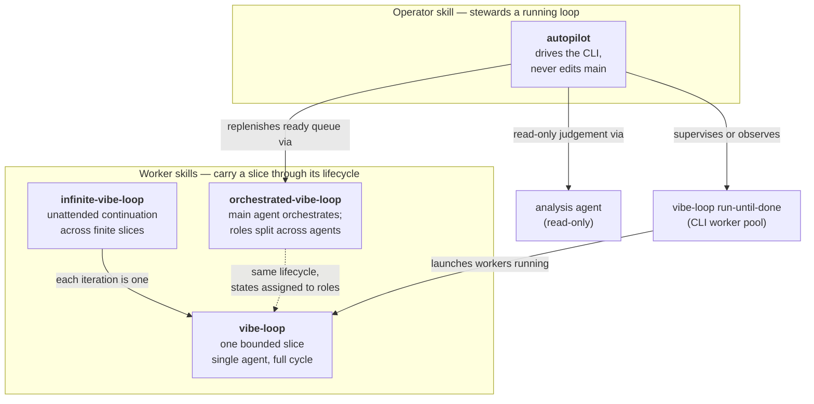
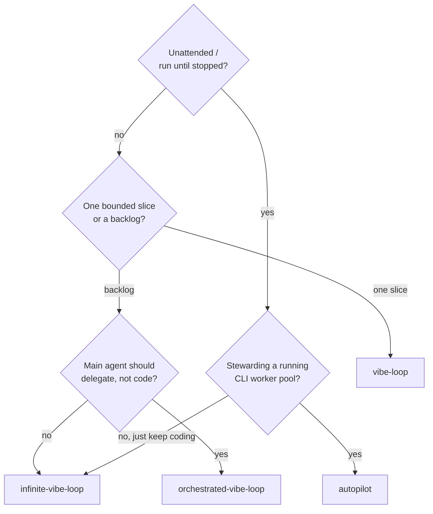
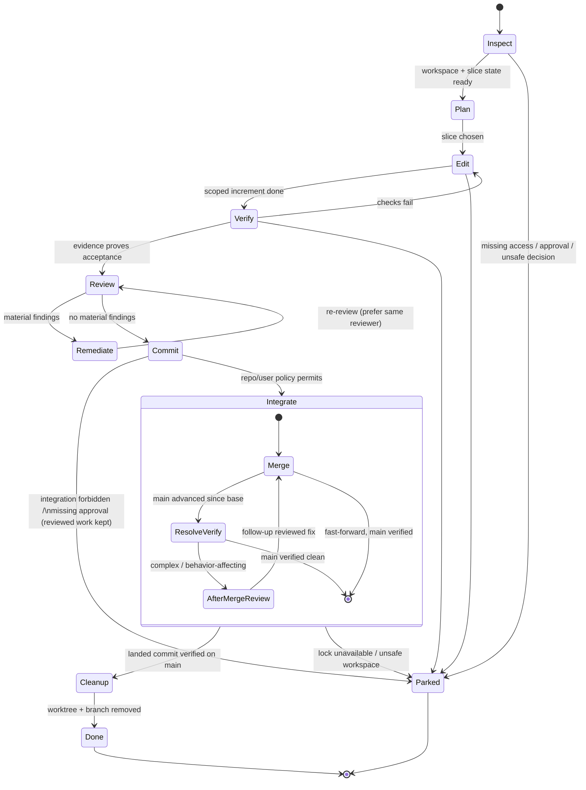
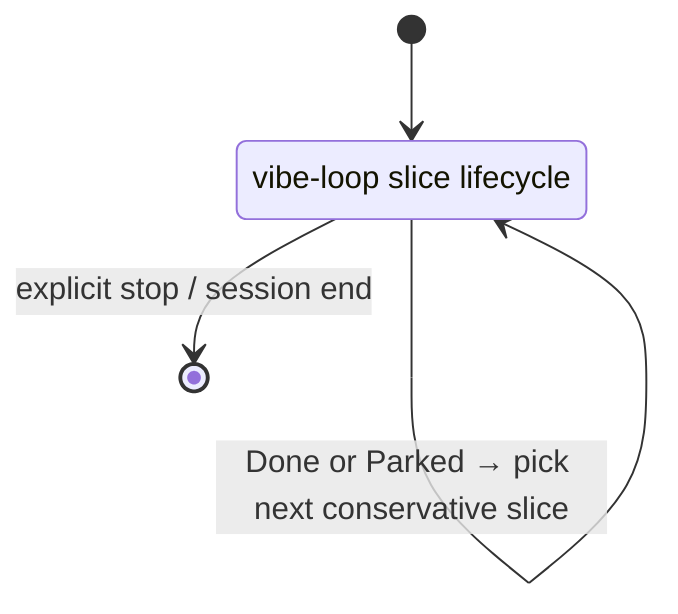
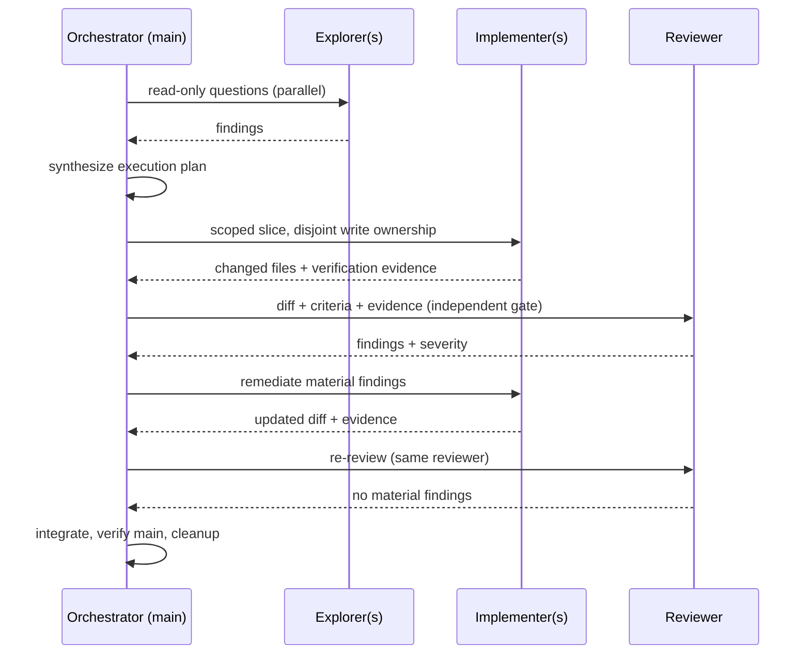
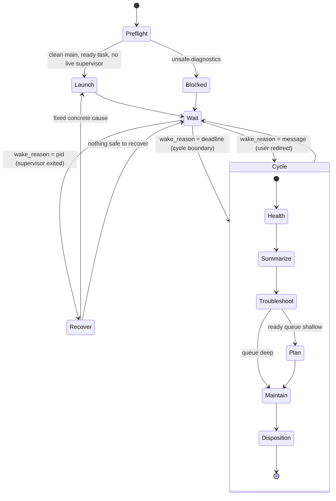

# Skill Work Modes

This note diagrams how the four bundled skills relate and how a single slice
moves through its lifecycle. The skill `SKILL.md` files remain the canonical
contract — these diagrams are derived documentation and intentionally omit
detail that lives in the prose. When a diagram and a skill disagree, the skill
is right; fix the diagram.

Two questions need two different pictures:

1. **Which skill, and how do they nest?** A composition map — *not* a state
   machine. There are no transitions between skills; there is delegation and
   containment.
2. **How does one slice progress?** A finite-state machine. The per-slice
   lifecycle has real states, guarded transitions, and cycles.

## Composition map

The package ships three worker skills (which carry a slice through its lifecycle)
and one operator skill (which stewards a running loop and never edits product
code itself).

Key relationships the prose makes explicit:

- `infinite-vibe-loop` requires every iteration to satisfy the finite `vibe-loop`
  slice contract; its only addition is continuation after a completed, parked, or
  blocked slice.
- `orchestrated-vibe-loop` runs the *same* lifecycle but forbids the main agent
  from being the worker: lifecycle states are assigned to explorer, implementer,
  and reviewer agents (see the swimlane below).
- `autopilot` supervises `vibe-loop run-until-done` (a CLI worker pool) — starting
  one only when no live supervisor exists, otherwise observing the external one —
  and invokes `orchestrated-vibe-loop` for planning. Judgement calls the
  supervisor cannot make mechanically go to a *read-only* analysis agent.

### Choosing a mode

## Slice lifecycle (the FSM)

Every worker skill shares this machine. `vibe-loop` runs it once; the others
specialize it (continuation back-edge for infinite, role assignment for
orchestrated).

The two dominant cycles are **Review ⇄ Remediate** (the review gate) and the
composite **Integrate** sub-cycle that handles `main` advancing after review.
`Parked` is a terminal reachable from almost any state on missing access,
required approval, destructive-action confirmation, or an unsafe decision; safe
completed work (including a committed-but-unintegrated reviewed slice) is
preserved, not discarded.

What the FSM deliberately does *not* show — and where the prose is load-bearing:

- **Guards carry the meaning.** "Integrate vs Park" hinges on *permitted to
  integrate? lock available? main advanced? workspace safe?* The edge labels are
  a summary; the skill text is authoritative.
- **No concurrency.** This is a single-slice, single-locus machine. It does not
  model multiple workers or a supervisor — see the swimlane and cycle below.

### `infinite-vibe-loop` continuation

The same machine plus a back-edge: instead of halting at `Done`/`Parked`, the
loop selects the next conservative slice and re-enters `Inspect`. It stops only
on explicit user instruction or session end.

## `orchestrated-vibe-loop` (why a flat FSM is not enough)

Orchestrated mode runs the same lifecycle but with the main agent as a
coordinator and the states assigned to distinct agents, several of which run
concurrently. A sequence/swimlane view captures the handoffs and parallelism
that a single-locus FSM cannot.

The orchestrator owns the integration gate and never authors product code or
treats its own inspection as the independent review.

## `autopilot` operator cycle

Autopilot is genuinely cyclic and is well modelled as its own FSM, distinct from
the slice lifecycle the workers run. It wakes on a cycle boundary or on
supervisor exit, runs the cycle, and sleeps again until stopped.

The cycle delegates: `Summarize` and `Troubleshoot` run read-only subagents,
`Plan` runs `orchestrated-vibe-loop` in a worktree with independent review,
`Disposition` reaps only orphaned, merged, clean, non-live-claimed worktrees
under evidence-gated guardrails. Recovery is non-destructive — it never deletes
worktrees, resets branches, or steals locks outside those bounded exceptions.
