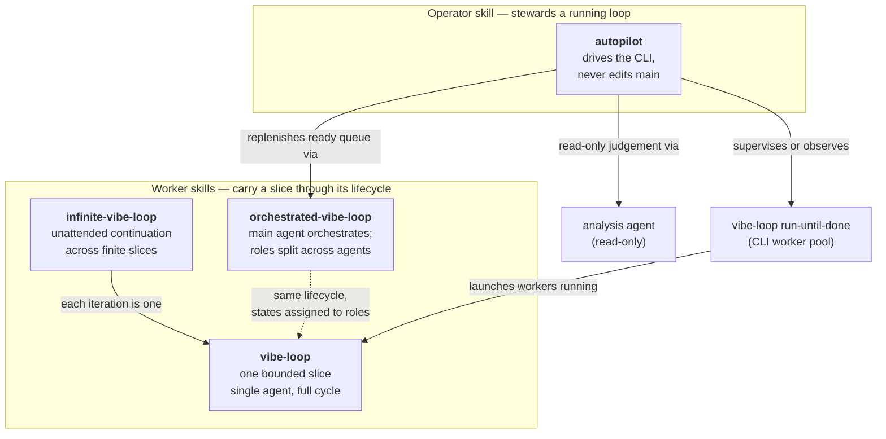
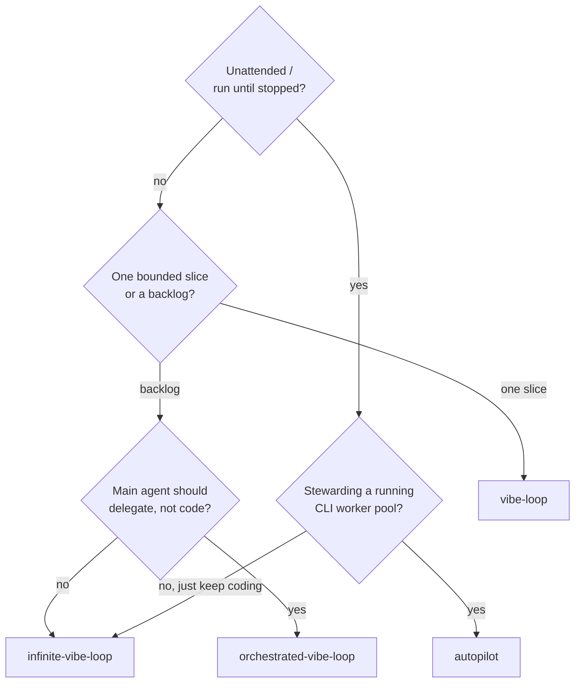
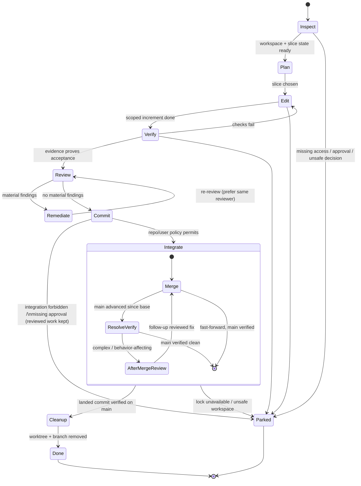
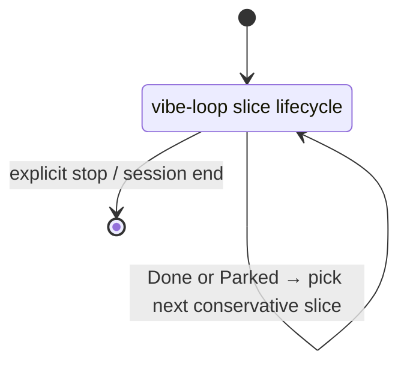
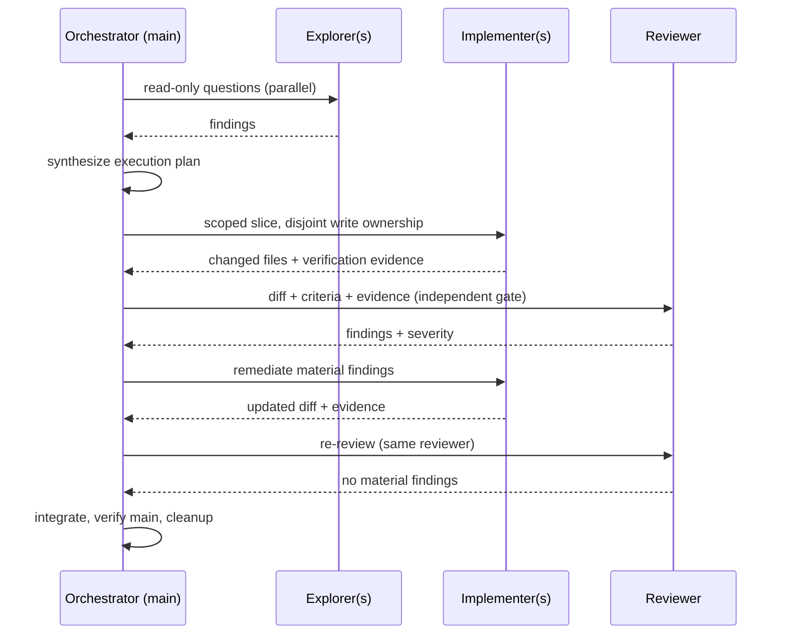
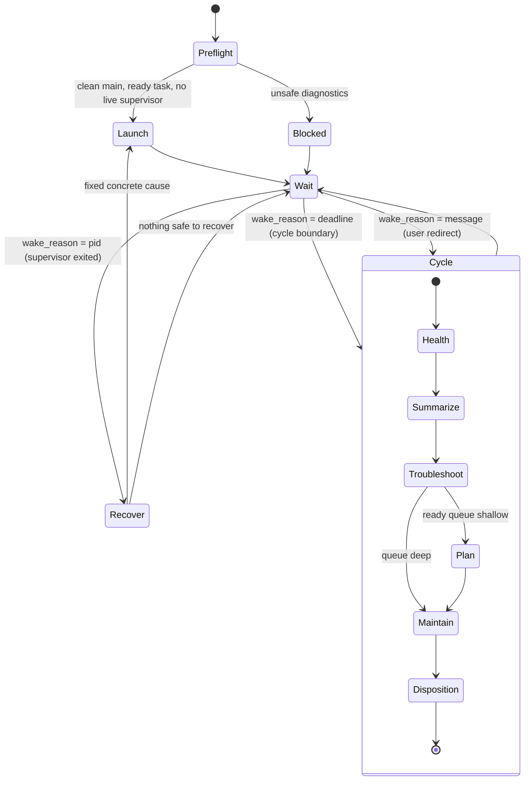

# Skill Work Modes

This note diagrams how the four bundled skills relate and how a single slice
moves through its lifecycle. The skill `SKILL.md` files remain the canonical
contract — these diagrams are derived documentation and intentionally omit
detail that lives in the prose. When a diagram and a skill disagree, the skill
is right; fix the diagram.

Two questions need two different pictures:

1. **Which skill, and how do they nest?** A composition map — *not* a state
   machine. There are no transitions between skills; there is delegation and
   containment.
2. **How does one slice progress?** A finite-state machine. The per-slice
   lifecycle has real states, guarded transitions, and cycles.

## Composition map

The package ships three worker skills (which carry a slice through its lifecycle)
and one operator skill (which stewards a running loop and never edits product
code itself).


```mermaid
flowchart TB
    subgraph workers["Worker skills — carry a slice through its lifecycle"]
        VL["<b>vibe-loop</b><br/>one bounded slice<br/>single agent, full cycle"]
        IVL["<b>infinite-vibe-loop</b><br/>unattended continuation<br/>across finite slices"]
        OVL["<b>orchestrated-vibe-loop</b><br/>main agent orchestrates;<br/>roles split across agents"]
    end
    subgraph operator["Operator skill — stewards a running loop"]
        AP["<b>autopilot</b><br/>drives the CLI,<br/>never edits main"]
    end

    IVL -->|each iteration is one| VL
    OVL -.->|same lifecycle,<br/>states assigned to roles| VL
    RUD["vibe-loop run-until-done<br/>(CLI worker pool)"]
    AP -->|supervises or observes| RUD
    RUD -->|launches workers running| VL
    AP -->|replenishes ready queue via| OVL
    AP -->|read-only judgement via| AA["analysis agent<br/>(read-only)"]
```

Key relationships the prose makes explicit:

- `infinite-vibe-loop` requires every iteration to satisfy the finite `vibe-loop`
  slice contract; its only addition is continuation after a completed, parked, or
  blocked slice.
- `orchestrated-vibe-loop` runs the *same* lifecycle but forbids the main agent
  from being the worker: lifecycle states are assigned to explorer, implementer,
  and reviewer agents (see the swimlane below).
- `autopilot` supervises `vibe-loop run-until-done` (a CLI worker pool) — starting
  one only when no live supervisor exists, otherwise observing the external one —
  and invokes `orchestrated-vibe-loop` for planning. Judgement calls the
  supervisor cannot make mechanically go to a *read-only* analysis agent.

### Choosing a mode


```mermaid
flowchart TD
    Q1{"Unattended /<br/>run until stopped?"}
    Q2{"One bounded slice<br/>or a backlog?"}
    Q3{"Main agent should<br/>delegate, not code?"}
    Q4{"Stewarding a running<br/>CLI worker pool?"}

    Q1 -->|no| Q2
    Q2 -->|one slice| VL["vibe-loop"]
    Q2 -->|backlog| Q3
    Q3 -->|no| IVL["infinite-vibe-loop"]
    Q3 -->|yes| OVL["orchestrated-vibe-loop"]
    Q1 -->|yes| Q4
    Q4 -->|yes| AP["autopilot"]
    Q4 -->|no, just keep coding| IVL
```

## Slice lifecycle (the FSM)

Every worker skill shares this machine. `vibe-loop` runs it once; the others
specialize it (continuation back-edge for infinite, role assignment for
orchestrated).


```mermaid
stateDiagram-v2
    [*] --> Inspect
    Inspect --> Plan: workspace + slice state ready
    Plan --> Edit: slice chosen
    Edit --> Verify: scoped increment done
    Verify --> Edit: checks fail
    Verify --> Review: evidence proves acceptance

    Review --> Remediate: material findings
    Remediate --> Review: re-review (prefer same reviewer)
    Review --> Commit: no material findings

    Commit --> Integrate: repo/user policy permits
    Commit --> Parked: integration forbidden /\nmissing approval (reviewed work kept)

    state Integrate {
        [*] --> Merge
        Merge --> ResolveVerify: main advanced since base
        ResolveVerify --> AfterMergeReview: complex / behavior-affecting
        AfterMergeReview --> Merge: follow-up reviewed fix
        ResolveVerify --> [*]: main verified clean
        Merge --> [*]: fast-forward, main verified
    }

    Integrate --> Cleanup: landed commit verified on main
    Integrate --> Parked: lock unavailable / unsafe workspace
    Cleanup --> Done: worktree + branch removed
    Done --> [*]

    Inspect --> Parked: missing access / approval / unsafe decision
    Edit --> Parked
    Verify --> Parked
    Parked --> [*]
```

The two dominant cycles are **Review ⇄ Remediate** (the review gate) and the
composite **Integrate** sub-cycle that handles `main` advancing after review.
`Parked` is a terminal reachable from almost any state on missing access,
required approval, destructive-action confirmation, or an unsafe decision; safe
completed work (including a committed-but-unintegrated reviewed slice) is
preserved, not discarded.

### Runtime-owned reviewer route

Runtime-owned orchestration can route independent review to an agent profile
selected from the route that implemented the candidate. The authoritative
behavior is [PRD-ORC-005](prd/run-orchestration.md#prd-orc-005-reviewer-routing-identity-and-continuation),
and the configuration syntax is in
[Orchestration and reviewer routing](configuration.md#orchestration-and-reviewer-routing).

```toml
[agent]
kind = "claude"
model = "opus"
effort = "medium"

[agent.profiles.review]
kind = "codex"
command = "codex review {prompt}"

[orchestration]
mode = "runtime-owned"
reviewer_profile = "review"
task_provenance_mode = "external-confirmed"
external_completion_actor = "external-system"
max_initial_review_passes = 1
max_closure_review_passes = 2
reviewer_concurrency_budget = 1
max_candidate_reanchors = 2
```

The reviewer command must accept `{prompt}`. The runtime supplies the typed
candidate, gate evidence, policy references, and prior findings, then records
route identity, duration, native usage when available, and continuation
ordinals. Initial review and targeted closure have separate bounded budgets;
reviewer concurrency is independent from implementation `--jobs`.

An exact explicit `codex review {prompt}` route is valid only without
first-class `model` or `effort`. That command cannot expose enough effective
route metadata to prove either setting before candidate disclosure. Configure a
placeholder-capable command or leave those settings unset. Claude, custom,
placeholder-based, worker-owned, and unbound exact-review routes retain their
normal resolution behavior.

Reviewer output is a schema-validated JSON verdict. A malformed verdict receives
one bounded re-ask; a second malformed response blocks review while retaining
the candidate and passed gate evidence. Findings live in a candidate-scoped
ledger. Closure prompts contain that ledger and prior gate evidence rather than
starting an unbounded new review.

Provider continuation support is explicit. Claude supports injected sessions
and resume. Codex implementation uses `exec resume`, but `codex review` has no
review-session resume surface, so targeted closure starts a fresh bounded review
and records `continuation_fallback = "provider_unsupported"`; missing or expired
sessions similarly record their fallback reason. Reviewer prompts forbid nested
model delegation.

The runtime owns the review budgets and candidate fingerprint. Later candidate
fingerprints consume the remaining closure budget instead of resetting it, and
an unfinished `review_started` record parks rather than replaying silently.
Before gates, a stale-base candidate may be re-anchored only when Git reports no
conflict and the aggregate binary diff is unchanged. The runtime reruns gates
after a successful re-anchor; `max_candidate_reanchors` bounds repeated base
movement.

Runtime-owned mode also owns integration and task provenance. Command-backed
task sources that activate work must configure `reset`; adapter completion
requires `complete`. Repositories that intentionally retain agent-owned
verification, review, integration, and task-source mutation must opt into
`mode = "worker-owned"`.

What the FSM deliberately does *not* show — and where the prose is load-bearing:

- **Guards carry the meaning.** "Integrate vs Park" hinges on *permitted to
  integrate? lock available? main advanced? workspace safe?* The edge labels are
  a summary; the skill text is authoritative.
- **No concurrency.** This is a single-slice, single-locus machine. It does not
  model multiple workers or a supervisor — see the swimlane and cycle below.

### `infinite-vibe-loop` continuation

The same machine plus a back-edge: instead of halting at `Done`/`Parked`, the
loop selects the next conservative slice and re-enters `Inspect`. It stops only
on explicit user instruction or session end.


```mermaid
stateDiagram-v2
    [*] --> Slice
    Slice: vibe-loop slice lifecycle
    Slice --> Slice: Done or Parked → pick next conservative slice
    Slice --> [*]: explicit stop / session end
```

## `orchestrated-vibe-loop` (why a flat FSM is not enough)

Orchestrated mode runs the same lifecycle but with the main agent as a
coordinator and the states assigned to distinct agents, several of which run
concurrently. A sequence/swimlane view captures the handoffs and parallelism
that a single-locus FSM cannot.


```mermaid
sequenceDiagram
    participant O as Orchestrator (main)
    participant E as Explorer(s)
    participant I as Implementer(s)
    participant R as Reviewer

    O->>E: read-only questions (parallel)
    E-->>O: findings
    O->>O: synthesize execution plan
    O->>I: scoped slice, disjoint write ownership
    I-->>O: changed files + verification evidence
    O->>R: diff + criteria + evidence (independent gate)
    R-->>O: findings + severity
    O->>I: remediate material findings
    I-->>O: updated diff + evidence
    O->>R: re-review (same reviewer)
    R-->>O: no material findings
    O->>O: integrate, verify main, cleanup
```

The orchestrator owns the integration gate and never authors product code or
treats its own inspection as the independent review.

## `autopilot` operator cycle

Autopilot is genuinely cyclic and is well modelled as its own FSM, distinct from
the slice lifecycle the workers run. It wakes on a cycle boundary or on
supervisor exit, runs the cycle, and sleeps again until stopped.


```mermaid
stateDiagram-v2
    [*] --> Preflight
    Preflight --> Launch: clean main, ready task, no live supervisor
    Preflight --> Blocked: unsafe diagnostics
    Launch --> Wait
    Blocked --> Wait

    Wait --> Cycle: wake_reason = deadline (cycle boundary)
    Wait --> Recover: wake_reason = pid (supervisor exited)
    Wait --> Cycle: wake_reason = message (user redirect)

    state Cycle {
        [*] --> Health
        Health --> Summarize
        Summarize --> Troubleshoot
        Troubleshoot --> Plan: ready queue shallow
        Troubleshoot --> Maintain: queue deep
        Plan --> Maintain
        Maintain --> Disposition
        Disposition --> [*]
    }
    Cycle --> Wait

    Recover --> Launch: fixed concrete cause
    Recover --> Wait: nothing safe to recover
```

The cycle delegates: `Summarize` and `Troubleshoot` run read-only subagents,
`Plan` runs `orchestrated-vibe-loop` in a worktree with independent review,
`Disposition` reaps only clean, unambiguously owned remnants with a completed
worker report and containment in both local and remote `main`, under
evidence-gated guardrails. Recovery is non-destructive — it never deletes
worktrees, resets branches, or steals locks outside those bounded exceptions.
